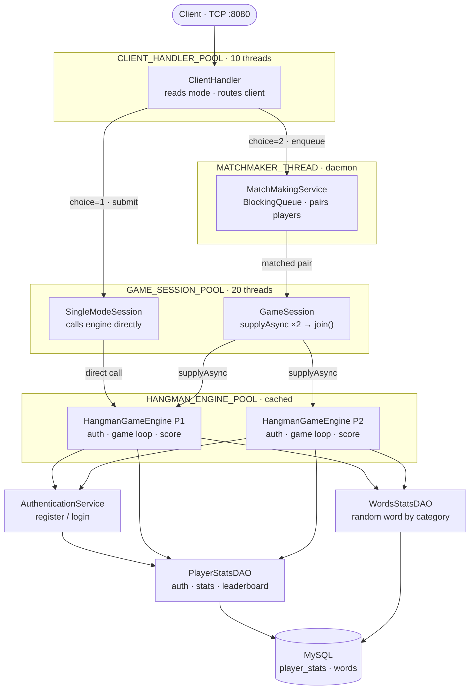

# HangmanCLI 🎮

A multiplayer terminal-based Hangman game built in Java using raw TCP sockets, thread pools, and a MySQL database. Supports single-player and real-time 1v1 multiplayer matchmaking, persistent player accounts with authentication, time-based scoring, and a live leaderboard.

---

## Table of Contents

- [Features](#features)
- [Architecture](#architecture)
- [Project Structure](#project-structure)
- [Database Schema](#database-schema)
- [Prerequisites](#prerequisites)
- [Setup and Installation](#setup-and-installation)
- [Running the Application](#running-the-application)
- [Gameplay](#gameplay)
- [Scoring System](#scoring-system)
- [Design Decisions](#design-decisions)
- [Known Limitations](#known-limitations)

---

## Features

- **Single Player mode** — Play Hangman solo against the clock
- **Multiplayer mode** — Automatic 1v1 matchmaking; both players play simultaneously and scores are compared at the end
- **Player Authentication** — Register with a username and password; returning players log in to preserve their stats
- **Persistent Stats** — `played_count`, `highest_score`, and `total_score` (cumulative XP) are tracked per player in MySQL
- **Leaderboard** — Top 5 players ranked by total XP, with highest single-game score as a tiebreaker; viewable from the main menu or shown automatically after every game
- **Word Categories** — Comic Series, Thriller Movies, Sci-Fi Movies; words fetched randomly from the database
- **Time-based Scoring** — Faster guesses earn bonus points on top of the base accuracy score
- **ASCII Hangman** — Full 7-frame progressive ASCII art gallows

---

## Architecture

The server uses three dedicated thread pools with clear ownership to avoid thread-pool deadlocks:



```
CLIENT_HANDLER_POOL (10 threads)
  └── ClientHandler          reads mode choice, routes to session or matchmaker

GAME_SESSION_POOL (20 threads)
  └── SingleModeSession      runs one player's full game flow
  └── GameSession            coordinates two players; blocks on join() waiting for engines

HANGMAN_ENGINE_POOL (cached threads)
  └── HangmanGameEngine      blocking I/O per player — auth, category, guess loop, DB update

MATCHMAKER_THREAD (1 daemon thread)
  └── MatchMakingService     BlockingQueue.take() loop; pairs players and submits GameSession
```

**Why three pools?** `GameSession` runs on `GAME_SESSION_POOL` and submits engine tasks to `HANGMAN_ENGINE_POOL` via `CompletableFuture.supplyAsync`, then blocks with `.join()`. If both used the same pool, a saturated pool would deadlock — all threads blocking on `join()` with no threads left to run the engine tasks.

**Why cached pool for engines?** `HangmanGameEngine.run()` spends almost all its time blocked on `in.readLine()` waiting for the human to type. These are I/O-bound threads, not CPU-bound, so holding many of them is safe. A fixed pool would starve new games when all slots are occupied waiting for slow players.

**Signal-based protocol:** the server sends structured signal strings (`INPUT_USERNAME`, `INPUT_CATEGORY`, `AUTH_SUCCESS`, etc.) on the same TCP stream as regular messages. The client switches on these to know when to prompt for input vs. just display text, avoiding the need for a separate control channel.

---

## Project Structure

```
src/
├── client/
│   └── GameClient.java          # Terminal client — signal-driven read loop
├── dao/
│   ├── PlayerStatsDAO.java      # Auth (register/login) + stats CRUD
│   └── WordsStatsDAO.java       # Random word fetch by category
├── model/
│   ├── PlayerResult.java        # Carries username + score out of the engine
│   ├── PlayerStats.java         # Full player record from DB
│   └── WaitingPlayer.java       # Socket + username holder passed between services
├── service/
│   ├── AuthenticationService.java  # Handles new-user registration and returning-user login
│   ├── ClientHandler.java          # First contact: reads mode, routes client
│   ├── GameServer.java             # Entry point; ServerSocket accept loop
│   ├── GameSession.java            # Multiplayer: runs two engines in parallel
│   ├── HangmanGameEngine.java      # Core game loop per player
│   ├── MatchMakingService.java     # Daemon thread; pairs players from BlockingQueue
│   ├── Session.java                # Marker interface (extends Runnable)
│   └── SingleModeSession.java      # Single player wrapper around the engine
└── util/
    ├── DBConnection.java           # Static factory; loads dbconfig.properties
    ├── DBConfigProperties.java     # POJO holding DB URL/user/password
    ├── LeaderboardPrinter.java     # Formats and sends top-5 table over a PrintWriter
    └── PasswordUtil.java           # SHA-256 hashing and verification

resources/
└── dbconfig.properties            # DB credentials — gitignored, never committed
```

---

## Database Schema

```sql
CREATE TABLE player_stats (
    id             INT          AUTO_INCREMENT PRIMARY KEY,
    username       VARCHAR(50)  NOT NULL UNIQUE,
    password_hash  VARCHAR(64)  NOT NULL,
    played_count   INT          NOT NULL DEFAULT 0,
    highest_score  INT          NOT NULL DEFAULT 0,
    total_score    INT          NOT NULL DEFAULT 0,
    last_played    TIMESTAMP    NOT NULL
);

CREATE TABLE words (
    id        INT          AUTO_INCREMENT PRIMARY KEY,
    word      VARCHAR(100) NOT NULL,
    category  VARCHAR(50)  NOT NULL
);

-- Sample categories: 'Comic-Series', 'Thriller-Movies', 'SciFi-Movies'
INSERT INTO words (word, category) VALUES
('batman',   'Comic-Series'),
('inception','Thriller-Movies'),
('interstellar', 'SciFi-Movies');
```

**`username`** carries a `UNIQUE` constraint, which is what makes `INSERT ... ON DUPLICATE KEY UPDATE` and race-condition-free registration possible.

---

## Prerequisites

| Requirement | Version |
|---|---|
| Java | 17 or higher |
| MySQL | 8.0.19 or higher |
| MySQL Connector/J | 9.x (JAR in `lib/`) |

---

## Setup and Installation

**1. Clone the repository**
```bash
git clone https://github.com/kishores046/HangmanCLI.git
cd HangmanCLI
```

---

**2. Add the MySQL driver to the project**

<details>
<summary><b>IntelliJ IDEA</b></summary>

```
File → Project Structure (Ctrl+Alt+Shift+S)
  → Modules
  → Dependencies tab
  → click "+" (bottom left)
  → JARs or directories
  → navigate to lib/mysql-connector-j-9.x.x.jar
  → OK → Apply → OK
```

The JAR now appears under **External Libraries** in the project tree.

</details>

<details>
<summary><b>Eclipse</b></summary>

```
Right-click the project in Package Explorer
  → Build Path
  → Configure Build Path
  → Libraries tab
  → Add External JARs...
  → navigate to lib/mysql-connector-j-9.x.x.jar
  → Open → Apply and Close
```

The JAR now appears under **Referenced Libraries** in the project tree.

</details>

---

**3. Create the database**
```sql
CREATE DATABASE hangman;
USE hangman;
-- then run the CREATE TABLE statements from the Database Schema section above
```

---

**4. Configure database credentials**

Create the file `resources/dbconfig.properties`.
This file is gitignored and must **never be committed** — it contains your database password.

```properties
DB_URL      = jdbc:mysql://localhost:3306/hangman
DB_USER     = root
DB_PASSWORD = your_password_here
```

The file must be on the classpath root so `getResourceAsStream("/dbconfig.properties")` can find it.
Each IDE handles this differently:

<details>
<summary><b>IntelliJ IDEA — mark resources/ as a Resources Root</b></summary>

```
Right-click the resources/ folder in the Project tree
  → Mark Directory as
  → Resources Root
```

The folder icon turns blue/orange. IntelliJ now copies everything inside it
to the output directory alongside `.class` files at build time.

</details>

<details>
<summary><b>Eclipse — add resources/ as a source folder</b></summary>

Eclipse does not have a "Resources Root" concept. Instead, add `resources/`
as a source folder so Eclipse copies its contents to `bin/` (the classpath root):

```
Right-click the project
  → Build Path
  → Configure Build Path
  → Source tab
  → Add Folder...
  → tick resources/
  → OK → Apply and Close
```

`resources/` now has a small package icon. Eclipse will copy `dbconfig.properties`
into `bin/` automatically on every build, making it visible to `getResourceAsStream`.

> ⚠️ After this step, right-click the project → **Refresh** so Eclipse picks up the new source folder entry.

</details>

<details>
<summary><b>Command line (no IDE)</b></summary>

Place `dbconfig.properties` directly inside `src/` (not in any package subfolder):

```
src/
  dbconfig.properties    ← here
  client/
  dao/
  ...
```

Then compile with:
```bash
# Windows
javac -cp "src;lib/mysql-connector-j-9.x.x.jar" -d out src/**/*.java
copy src\dbconfig.properties out\

# Mac/Linux
javac -cp "src:lib/mysql-connector-j-9.x.x.jar" -d out $(find src -name "*.java")
cp src/dbconfig.properties out/
```

The manual `copy`/`cp` step is required because `javac` only copies `.java` files to the output directory — it ignores `.properties` files.

</details>

---

**5. Build**

<details>
<summary><b>IntelliJ IDEA</b></summary>

Press `Ctrl+F9` (Build Project) or go to `Build → Build Project`.
Compiled output goes to `out/production/HangManGame/`.

</details>

<details>
<summary><b>Eclipse</b></summary>

Eclipse builds automatically on save (`Project → Build Automatically` is on by default).
To force a full rebuild: `Project → Clean → Clean all projects → OK`.
Compiled output goes to `bin/`.

</details>

---

## Running the Application

> ⚠️ **Important for multiplayer:** the password prompt uses `System.console().readPassword()` to hide typed characters. `System.console()` returns `null` inside IDE consoles — the password will be visible as plain text. This is a known IDE limitation. When running from a real terminal window the password is hidden correctly.

---

**Start the server first**

<details>
<summary><b>IntelliJ IDEA</b></summary>

Open `service/GameServer.java` → click the green Run arrow next to `main()`, or right-click → `Run 'GameServer.main()'`.

The **Run** panel at the bottom shows server logs. Leave it running.

</details>

<details>
<summary><b>Eclipse</b></summary>

Open `service/GameServer.java` → right-click anywhere in the editor → `Run As → Java Application`.

The **Console** view at the bottom shows server logs. Leave it running.

To run a second configuration (the client) alongside it, Eclipse supports multiple simultaneous run configurations — see the client section below.

</details>

<details>
<summary><b>Terminal</b></summary>

```bash
# Windows
java -cp "out;lib/mysql-connector-j-9.x.x.jar" service.GameServer

# Mac/Linux
java -cp "out:lib/mysql-connector-j-9.x.x.jar" service.GameServer
```

</details>

---

**Start one or more clients**

<details>
<summary><b>IntelliJ IDEA</b></summary>

Open `client/GameClient.java` → right-click → `Run 'GameClient.main()'`.

For **multiplayer**, you need two client instances running simultaneously.
IntelliJ allows this — go to:
```
Run → Edit Configurations
  → select GameClient
  → tick "Allow multiple instances"
  → Apply
```
Then run `GameClient` twice. Each opens its own console tab.

> **Password visibility:** IntelliJ's built-in console does not allocate a real terminal, so `System.console()` returns `null` and the password field is visible. To hide it, run the client from an external terminal window instead (see Terminal tab).

</details>

<details>
<summary><b>Eclipse</b></summary>

Open `client/GameClient.java` → right-click → `Run As → Java Application`.

For **multiplayer**, Eclipse runs only one instance of each class by default.
To run a second client:
```
Run → Run Configurations
  → double-click "Java Application" to create a new config
  → Main Class: client.GameClient
  → Name it "GameClient 2"
  → Apply → Run
```
Both client consoles appear as separate tabs in the Console view.
Switch between them using the console selector dropdown (the monitor icon in the Console toolbar).

> **Password visibility:** Eclipse's console also returns `null` for `System.console()`. Password input will be visible. Run from an external terminal to hide it.

</details>

<details>
<summary><b>Terminal (recommended for correct password hiding)</b></summary>

Open separate terminal windows for each client:

```bash
# Windows — bin/ is Eclipse's output dir; use out/ for IntelliJ
java -cp "bin;lib/mysql-connector-j-9.x.x.jar" client.GameClient

# Mac/Linux
java -cp "bin:lib/mysql-connector-j-9.x.x.jar" client.GameClient
```

For multiplayer, open two terminal windows and run the same command in each.
Both clients will type in their own window with passwords fully hidden.

</details>

> For multiplayer, start two clients and have both choose option **2 (Multi Player)**. The matchmaker pairs them automatically the moment both are in the queue.

---

## Gameplay

```
Choose mode:
  1: Single Player
  2: Multi Player
  3: Leaderboard
> 1

Enter your username: alice
Username 'alice' is available! Create a password:
Password (hidden): ••••••••
Account created! Welcome, alice!

Welcome alice! Let's play Hangman.
Choose your category:
  1. Comic-Series
  2. Thriller-Movies
  3. SciFi-Movies
Enter 1, 2 or 3:
> 2

   +---+
   |   |
       |
       |
       |
       |
  =========
Word: _______

Enter your guess: t
Word: t_____t
Wrong attempts: 0/6
...
Congratulations alice! You guessed the word: twilight
Your score: 72
```

**Authentication flow:**
- First time with a username → prompted to create a password → account registered
- Returning player → prompted for password → up to 3 attempts → blocked on 3 failures

---

## Scoring System

```
Base score  = (MAX_ATTEMPTS - wrongAttempts) × 10
Time bonus  = max(0, 60 - elapsedSeconds)
Final score = base score + time bonus
```

Guessing with zero wrong answers in under 60 seconds gives the maximum score of `60 + 60 = 120`. Each wrong guess costs 10 points; each second over 60 costs 1 bonus point.

The leaderboard ranks by **total score** (cumulative XP across all games) with **highest single-game score** as the tiebreaker — rewarding consistent play over one lucky game.

---

## Design Decisions

**Why raw TCP sockets over HTTP?**
This project was built specifically to learn Java networking fundamentals — socket lifecycle, stream handling, connection threading. A framework like Spring Boot would have hidden all of that.

**Why three executor pools?**
A single shared pool causes deadlock when `GameSession` (running on the pool) calls `CompletableFuture.supplyAsync(..., samePool).join()` — all threads end up blocked waiting for tasks that can never be scheduled. Separating session coordination from engine execution eliminates this entirely.

**Why `BlockingQueue` for matchmaking?**
`LinkedBlockingQueue.take()` blocks the matchmaker thread cleanly until two players are available, without polling or `Thread.sleep()`. It's the textbook producer-consumer pattern and requires zero explicit synchronization.

**Why `INSERT ... ON DUPLICATE KEY UPDATE` for stats?**
The original check-then-insert pattern had a race condition: two threads finishing simultaneously for the same new user both see `null` from `getPlayerStats()` and both attempt `INSERT`, causing a duplicate-key error on the second. The UPSERT is atomic at the database level, eliminating the race entirely.

**Why SHA-256 for passwords?**
No external libraries are used in this project. SHA-256 is available in the Java standard library and is sufficient for a learning project. In a production system, BCrypt or Argon2 (intentionally slow, salted) would be the correct choice.

---

## Known Limitations

- **No reconnection** — if a client disconnects mid-game, the opponent's session hangs until `setSoTimeout()` is implemented
- **No SSL/TLS** — passwords are sent as plaintext over the TCP connection before hashing on the server; a production deployment would require TLS
- **Plain scanner in IDE** — `System.console()` returns `null` in IDE run configurations, so password input is visible in the IDE console (works correctly when run from a real terminal)
- **Single server instance** — no horizontal scaling; all state lives in the one JVM and the MySQL instance it connects to
