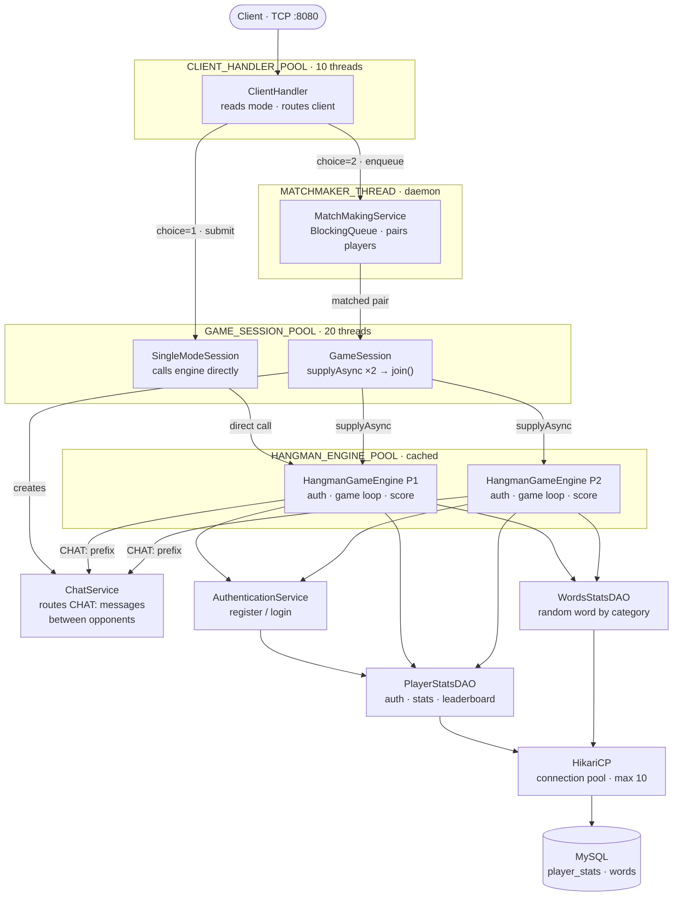

# HangmanCLI 🎮

A multiplayer terminal-based Hangman game built in Java using raw TCP sockets, thread pools, and a MySQL database. Supports single-player and real-time 1v1 multiplayer matchmaking, persistent player accounts with authentication, time-based scoring, a live leaderboard, and in-game chat between opponents.

---

## Table of Contents

- [Features](#features)
- [Architecture](#architecture)
- [Project Structure](#project-structure)
- [Database Schema](#database-schema)
- [Prerequisites](#prerequisites)
- [Setup and Installation](#setup-and-installation)
- [Running the Application](#running-the-application)
- [Gameplay](#gameplay)
- [Multiplayer Chat](#multiplayer-chat)
- [Protocol Reference](#protocol-reference)
- [Scoring System](#scoring-system)
- [Design Decisions](#design-decisions)
- [Known Limitations](#known-limitations)

---

## Features

- **Single Player mode** — Play Hangman solo against the clock
- **Multiplayer mode** — Automatic 1v1 matchmaking; both players play simultaneously and scores are compared at the end
- **In-game Chat** — Players can exchange messages with their opponent during a multiplayer game over the same TCP connection
- **Player Authentication** — Register with a username and password; returning players log in to preserve their stats
- **Persistent Stats** — `played_count`, `highest_score`, and `total_score` (cumulative XP) are tracked per player in MySQL
- **Leaderboard** — Top 5 players ranked by total XP, with highest single-game score as a tiebreaker; viewable from the main menu or shown automatically after every game
- **Word Categories** — Comic Series, Thriller Movies, Sci-Fi Movies; words fetched randomly from the database
- **Time-based Scoring** — Faster guesses earn bonus points on top of the base accuracy score
- **ASCII Hangman** — Full 7-frame progressive ASCII art gallows

---

## Architecture

The server uses three dedicated thread pools with clear ownership to avoid thread-pool deadlocks:



```
CLIENT_HANDLER_POOL (10 threads)
  └── ClientHandler          reads mode choice, routes to session or matchmaker

GAME_SESSION_POOL (20 threads)
  └── SingleModeSession      runs one player's full game flow
  └── GameSession            coordinates two players; blocks on join() waiting for engines

HANGMAN_ENGINE_POOL (cached threads)
  └── HangmanGameEngine      blocking I/O per player — auth, category, guess loop, DB update

MATCHMAKER_THREAD (1 daemon thread)
  └── MatchMakingService     BlockingQueue.take() loop; pairs players and submits GameSession
```

**Why three pools?** `GameSession` runs on `GAME_SESSION_POOL` and submits engine tasks to `HANGMAN_ENGINE_POOL` via `CompletableFuture.supplyAsync`, then blocks with `.join()`. If both used the same pool, a saturated pool would deadlock — all threads blocking on `join()` with no threads left to run the engine tasks.

**Why cached pool for engines?** `HangmanGameEngine.run()` spends almost all its time blocked on `in.readLine()` waiting for the human to type. These are I/O-bound threads, not CPU-bound, so holding many of them is safe. A fixed pool would starve new games when all slots are occupied waiting for slow players.

**Signal-based protocol:** the server sends structured signal strings (`INPUT_USERNAME`, `INPUT_CATEGORY`, `AUTH_SUCCESS`, etc.) on the same TCP stream as regular messages. The client switches on these to know when to prompt for input vs. just display text, avoiding the need for a separate control channel.

---

## Project Structure

```
src/
├── client/
│   └── GameClient.java             # Terminal client — signal-driven read loop
├── dao/
│   ├── PlayerStatsDAO.java         # Auth (register/login) + stats CRUD
│   └── WordsStatsDAO.java          # Random word fetch by category
├── model/
│   ├── PlayerResult.java           # Carries username + score out of the engine
│   ├── PlayerStats.java            # Full player record from DB
│   └── WaitingPlayer.java          # Socket + username holder passed between services
├── service/
│   ├── AuthenticationService.java  # Handles new-user registration and returning-user login
│   ├── ChatService.java            # Routes CHAT: messages between opponents (synchronized)
│   ├── ClientHandler.java          # First contact: reads mode, routes client
│   ├── GameServer.java             # Entry point; ServerSocket accept loop
│   ├── GameSession.java            # Multiplayer: runs two engines in parallel
│   ├── HangmanGameEngine.java      # Core game loop per player
│   ├── MatchMakingService.java     # Daemon thread; pairs players from BlockingQueue
│   ├── Session.java                # Marker interface (extends Runnable)
│   └── SingleModeSession.java      # Single player wrapper around the engine
└── util/
    ├── DBConfigProperties.java     # POJO holding DB URL/user/password
    ├── HikariConnectionManager.java# Static HikariDataSource factory (pool size 10)
    ├── JDBConnectionManager.java   # Legacy DriverManager factory (retained for reference)
    ├── LeaderboardPrinter.java     # Formats and sends top-5 table over a PrintWriter
    ├── PasswordUtil.java           # SHA-256 hashing and verification
    └── PropertyLoaderUtil.java     # Loads db-<profile>-config.properties from classpath

resources/
├── db-win-config.properties        # Windows DB credentials — gitignored
└── db-wsl-config.properties        # WSL DB credentials — gitignored
```

---

## Database Schema

```sql
CREATE TABLE player_stats (
    id             INT          AUTO_INCREMENT PRIMARY KEY,
    username       VARCHAR(50)  NOT NULL UNIQUE,
    password_hash  VARCHAR(64)  NOT NULL,
    played_count   INT          NOT NULL DEFAULT 0,
    highest_score  INT          NOT NULL DEFAULT 0,
    total_score    INT          NOT NULL DEFAULT 0,
    last_played    TIMESTAMP    NOT NULL
);

CREATE TABLE words (
    id        INT          AUTO_INCREMENT PRIMARY KEY,
    word      VARCHAR(100) NOT NULL,
    category  VARCHAR(50)  NOT NULL
);

-- Sample categories: 'Comic-Series', 'Thriller-Movies', 'SciFi-Movies'
INSERT INTO words (word, category) VALUES
('batman',        'Comic-Series'),
('inception',     'Thriller-Movies'),
('interstellar',  'SciFi-Movies');
```

**`username`** carries a `UNIQUE` constraint, which is what makes race-condition-free registration possible — a duplicate insert is caught as `SQLIntegrityConstraintViolationException` rather than silently creating a second row.

---

## Prerequisites

| Requirement | Version |
|---|---|
| Java | 17 or higher |
| MySQL | 8.0.19 or higher |
| MySQL Connector/J | 9.x (JAR in `lib/`) |
| HikariCP | 5.x (JAR in `lib/`) |
| SLF4J (HikariCP dependency) | 2.x (JAR in `lib/`) |

---

## Setup and Installation

**1. Clone the repository**
```bash
git clone https://github.com/kishores046/HangmanCLI.git
cd HangmanCLI
```

---

**2. Add JARs to the project**

The project requires three JARs in `lib/`:

| JAR | Purpose |
|---|---|
| `mysql-connector-j-9.x.x.jar` | JDBC driver |
| `hikaricp-5.x.x.jar` | Connection pooling |
| `slf4j-api-2.x.x.jar` + `slf4j-simple-2.x.x.jar` | Logging backend required by HikariCP |

<details>
<summary><b>IntelliJ IDEA</b></summary>

```
File → Project Structure (Ctrl+Alt+Shift+S)
  → Modules
  → Dependencies tab
  → click "+" → JARs or directories
  → select all JARs in lib/
  → OK → Apply → OK
```

All JARs appear under **External Libraries** in the project tree.

</details>

<details>
<summary><b>Eclipse</b></summary>

```
Right-click the project → Build Path → Configure Build Path
  → Libraries tab → Add External JARs...
  → select all JARs in lib/
  → Open → Apply and Close
```

The JARs appear under **Referenced Libraries** in the project tree.

</details>

---

**3. Create the database**
```sql
CREATE DATABASE hangman;
USE hangman;
-- then run the CREATE TABLE statements from the Database Schema section above
```

---

**4. Configure database credentials**

The project supports two environment profiles selected at runtime via `-Dprofile=`:

| Profile | File | When to use |
|---|---|---|
| `win` (default) | `resources/db-win-config.properties` | MySQL running as a native Windows service — no manual start needed |
| `wsl` | `resources/db-wsl-config.properties` | MySQL started manually as a Linux service inside WSL; host, port, or socket path may differ from the Windows instance |

> The two-profile setup exists because the server is developed on both Windows and WSL. On Windows, MySQL starts automatically as a service. Under WSL it must be started manually, and the connection details can differ depending on how MySQL is exposed across the WSL network boundary. If the server moves to a standalone Linux machine, the `wsl` profile covers that too without any code change.

Create whichever file matches your environment. Both are gitignored and must **never be committed**.

```properties
# db-win-config.properties  (or db-wsl-config.properties)
DB_URL      = jdbc:mysql://localhost:3306/hangman
DB_USER     = root
DB_PASSWORD = your_password_here
```

The file must be on the classpath root so `getResourceAsStream("/db-<profile>-config.properties")` can find it.

<details>
<summary><b>IntelliJ IDEA — mark resources/ as a Resources Root</b></summary>

```
Right-click the resources/ folder in the Project tree
  → Mark Directory as → Resources Root
```

The folder icon turns blue/orange. IntelliJ now copies everything inside it to the output directory alongside `.class` files at build time.

To switch profiles, edit the GameServer run configuration:
```
Run → Edit Configurations → GameServer → VM options
  → add: -Dprofile=wsl
```
Omit the flag to use the default `win` profile.

</details>

<details>
<summary><b>Eclipse — add resources/ as a source folder</b></summary>

```
Right-click the project → Build Path → Configure Build Path
  → Source tab → Add Folder... → tick resources/ → OK → Apply and Close
```

`resources/` now has a small package icon and its contents are copied to `bin/` on every build.

> ⚠️ After this step, right-click the project → **Refresh** so Eclipse picks up the new source folder entry.

To switch profiles in Eclipse:
```
Run → Run Configurations → select GameServer → Arguments tab → VM arguments
  → add: -Dprofile=wsl
```

</details>

<details>
<summary><b>Command line (no IDE)</b></summary>

Place the config file directly inside `src/`:
```
src/
  db-win-config.properties    ← here
  client/
  dao/
  ...
```

Compile and copy:
```bash
# Windows
javac -cp "src;lib/*" -d out src/**/*.java
copy src\db-win-config.properties out\

# Mac/Linux
javac -cp "src:lib/*" -d out $(find src -name "*.java")
cp src/db-win-config.properties out/
```

Pass the profile flag at runtime (see Running the Application below).

</details>

---

**5. Build**

<details>
<summary><b>IntelliJ IDEA</b></summary>

Press `Ctrl+F9` (Build Project) or go to `Build → Build Project`.
Compiled output goes to `out/production/HangManGame/`.

</details>

<details>
<summary><b>Eclipse</b></summary>

Eclipse builds automatically on save (`Project → Build Automatically` is on by default).
To force a full rebuild: `Project → Clean → Clean all projects → OK`.
Compiled output goes to `bin/`.

</details>

---

## Running the Application

> ⚠️ **Important for multiplayer:** the password prompt uses `System.console().readPassword()` to hide typed characters. `System.console()` returns `null` inside IDE consoles — the password will be visible as plain text. This is a known IDE limitation. When running from a real terminal window the password is hidden correctly.

---

**Start the server first**

<details>
<summary><b>IntelliJ IDEA</b></summary>

Open `service/GameServer.java` → click the green Run arrow next to `main()`, or right-click → `Run 'GameServer.main()'`.

To use the WSL profile: `Run → Edit Configurations → GameServer → VM options → -Dprofile=wsl`

The **Run** panel at the bottom shows server logs. Leave it running.

</details>

<details>
<summary><b>Eclipse</b></summary>

Open `service/GameServer.java` → right-click anywhere in the editor → `Run As → Java Application`.

The **Console** view at the bottom shows server logs. Leave it running.

</details>

<details>
<summary><b>Terminal</b></summary>

```bash
# Windows — default (win) profile
java -cp "out;lib/*" service.GameServer

# WSL / Linux
java -cp "out:lib/*" -Dprofile=wsl service.GameServer
```

</details>

---

**Start one or more clients**

<details>
<summary><b>IntelliJ IDEA</b></summary>

Open `client/GameClient.java` → right-click → `Run 'GameClient.main()'`.

For **multiplayer**, you need two client instances running simultaneously:
```
Run → Edit Configurations → select GameClient → tick "Allow multiple instances" → Apply
```
Then run `GameClient` twice. Each opens its own console tab.

</details>

<details>
<summary><b>Eclipse</b></summary>

Open `client/GameClient.java` → right-click → `Run As → Java Application`.

For **multiplayer**, create a second run configuration:
```
Run → Run Configurations → double-click "Java Application"
  → Main Class: client.GameClient
  → Name it "GameClient 2" → Apply → Run
```
Both client consoles appear as separate tabs in the Console view.

</details>

<details>
<summary><b>Terminal (recommended for correct password hiding)</b></summary>

```bash
# Windows
java -cp "out;lib/*" client.GameClient

# Mac/Linux
java -cp "out:lib/*" client.GameClient
```

For multiplayer, open two terminal windows and run the same command in each.

</details>

> For multiplayer, start two clients and have both choose option **2 (Multi Player)**. The matchmaker pairs them automatically the moment both are in the queue.

---

## Gameplay

```
Choose mode:
  1: Single Player
  2: Multi Player
  3: Leaderboard
> 1

Enter your username: alice
Username 'alice' is available! Create a password:
Password (hidden): ••••••••
Account created! Welcome, alice!

Welcome alice! Let's play Hangman.
Choose your category:
  1. Comic-Series
  2. Thriller-Movies
  3. SciFi-Movies
Enter 1, 2 or 3:
> 2

   +---+
   |   |
       |
       |
       |
       |
  =========
Word: _______

Your guess (letter / HINT / CHAT:message): t
Word: t_____t
Wrong attempts: 0/6
...
Congratulations alice! You guessed the word: twilight
Your score: 72
```

**Authentication flow:**
- First time with a username → prompted to create a password → account registered
- Returning player → prompted for password → up to 3 attempts → blocked on 3 failures

---

## Multiplayer Chat

Players can send messages to their opponent at any point during a multiplayer game without interrupting the game flow.

**Sending a message** — prefix your input with `CHAT:`:
```
Your guess (letter / HINT / CHAT:message): CHAT:good luck!
```

**Receiving a message** — the opponent's chat appears inline in your terminal:
```
[[CHAT]]bob: good luck!
```

**How it works under the hood:**

`GameSession` owns one `PrintWriter` per socket and passes both down to a `ChatService` instance before the game starts. Each `HangmanGameEngine` receives a reference to the same `ChatService`. When the engine reads a line starting with `CHAT:`, it strips the prefix and calls `chatService.route(out, username, message)` — which writes to the *other* writer — then `continue`s the loop without consuming the input as a guess.

`ChatService.route()` is `synchronized` to prevent interleaved output if both players send chat messages simultaneously. The sentinel `[[CHAT]]` prefix lets the client distinguish chat lines from game messages.

Single-player games pass `null` for `chatService`; the null check in the engine means the feature has zero impact on solo games.

---

## Protocol Reference

All communication travels in-band over the same TCP stream. The server prefixes structured signals so the client can switch on them:

| Signal / Prefix | Direction | Meaning |
|---|---|---|
| `INPUT_USERNAME` | Server → Client | Prompt the user to type their username |
| `INPUT_PASSWORD` | Server → Client | Prompt the user to type their password (hidden) |
| `INPUT_CATEGORY` | Server → Client | Prompt the user to choose a word category |
| `AUTH_SUCCESS` | Server → Client | Login or registration succeeded |
| `MATCH_FOUND` | Server → Client | Opponent found; game is starting |
| `CHAT:<text>` | Client → Server | Player is sending a chat message |
| `[[CHAT]]<user>: <text>` | Server → Client | Incoming chat message from opponent |
| `CHAT_SENT` | Server → Client | Silent ACK: chat message was delivered |
| `HINT` | Client → Server | Player is requesting a hint |
| `Ended` | Server → Client | Game over; client breaks out of the read loop |

---

## Connection Pooling

Database connections are managed by **HikariCP**, replacing the earlier single-connection `DBConnection` utility.

| Setting | Value | Reason |
|---|---|---|
| `maximumPoolSize` | 10 | Caps concurrent DB connections; matches typical MySQL `max_connections` headroom |
| `minimumIdle` | 2 | Keeps two warm connections ready; avoids cold-start latency on the first request after idle |
| `idleTimeout` | 30 000 ms | Returns idle connections to the pool after 30 s |
| `connectionTimeout` | 30 000 ms | Fails fast if no connection is available within 30 s |
| `maxLifetime` | 1 800 000 ms | Recycles connections every 30 min to avoid hitting MySQL's `wait_timeout` |

`HikariConnectionManager` initialises the pool once in a `static` block and exposes a single `getDataSource()` method. Both `PlayerStatsDAO` and `WordsStatsDAO` receive a `DataSource` reference at construction time — they never call a global factory directly, which makes the DAOs independently testable.

The legacy `JDBConnectionManager` (raw `DriverManager.getConnection`) is retained in the codebase for reference but is no longer used at runtime.

---

## Scoring System

```
Base score  = (MAX_ATTEMPTS - wrongAttempts) × 10
Time bonus  = max(0, 60 - elapsedSeconds)
Final score = base score + time bonus
```

Guessing with zero wrong answers in under 60 seconds gives the maximum score of `60 + 60 = 120`. Each wrong guess costs 10 points; each second over 60 costs 1 bonus point.

The leaderboard ranks by **total score** (cumulative XP across all games) with **highest single-game score** as the tiebreaker — rewarding consistent play over one lucky game.

---

## Design Decisions

**Why raw TCP sockets over HTTP?**
This project was built specifically to learn Java networking fundamentals — socket lifecycle, stream handling, connection threading. A framework like Spring Boot would have hidden all of that.

**Why three executor pools?**
A single shared pool causes deadlock when `GameSession` (running on the pool) calls `CompletableFuture.supplyAsync(..., samePool).join()` — all threads end up blocked waiting for tasks that can never be scheduled. Separating session coordination from engine execution eliminates this entirely.

**Why `BlockingQueue` for matchmaking?**
`LinkedBlockingQueue.take()` blocks the matchmaker thread cleanly until two players are available, without polling or `Thread.sleep()`. It's the textbook producer-consumer pattern and requires zero explicit synchronization.

**Why HikariCP instead of raw `DriverManager`?**
Every DAO method previously opened and closed a fresh `DriverManager` connection. Under multiplayer load, this creates two new TCP connections to MySQL per guess — wasteful and slow. HikariCP maintains a warm pool and hands out connections in microseconds. It also handles connection validation, leak detection, and graceful eviction of stale connections automatically.

**Why `DataSource` injected into DAOs, not a static factory?**
Passing `DataSource` through the constructor means each DAO is a plain object that can be instantiated in a test with any `DataSource` implementation (including an in-memory H2 pool). A static `HikariConnectionManager.getDataSource()` call buried inside DAO methods would make unit testing impossible without reflection or PowerMock.

**Why profile-based config files instead of one `dbconfig.properties`?**
The game is developed on Windows but also run inside WSL, which has a different MySQL socket path and host. A `-Dprofile=` JVM flag selects the right file at startup without any code change — the same pattern used by Spring profiles, applied manually here.

**Why `synchronized` on `ChatService.route()`?**
`PrintWriter.println()` is synchronized internally per character, but two rapid calls from different threads can still interleave at the line level — thread 1 writes `[[CHAT]]alice: ` and thread 2 starts writing `[[CHAT]]bob: ` before thread 1 finishes, producing garbage on the recipient's screen. Synchronizing the whole method prevents this.

**Why SHA-256 for passwords?**
No external libraries are used beyond HikariCP and the MySQL driver. SHA-256 is available in the Java standard library and is sufficient for a learning project. In a production system, BCrypt or Argon2 (intentionally slow, salted) would be the correct choice.

**Why profile-based config files instead of one dbconfig.properties?**
The server is developed on Windows but also run inside WSL or in Linux. The two environments differ in a few ways that affect the DB config: MySQL runs as a native Windows service and doesn't need a separate start step there, whereas under WSL it has to be started manually as a Linux service — and the host, port, or socket path can differ depending on how MySQL is exposed across the WSL network boundary. If the server is ever moved to a Linux machine entirely, the wsl profile (or a new linux one) covers that without touching code. A -Dprofile= JVM flag selects the right file at startup — the same pattern Spring uses for environment profiles, applied manually here.


---

## Known Limitations

- **No reconnection** — if a client disconnects mid-game, the opponent's session hangs until `setSoTimeout()` is implemented
- **No SSL/TLS** — passwords are sent as plaintext over the TCP connection before hashing on the server; a production deployment would require TLS
- **Plain scanner in IDE** — `System.console()` returns `null` in IDE run configurations, so password input is visible in the IDE console (works correctly when run from a real terminal)
- **Single server instance** — no horizontal scaling; all state lives in the one JVM and the MySQL instance it connects to
- **Chat is in-band only** — chat travels on the game TCP stream; there is no chat history, no persistence, and no offline messaging
