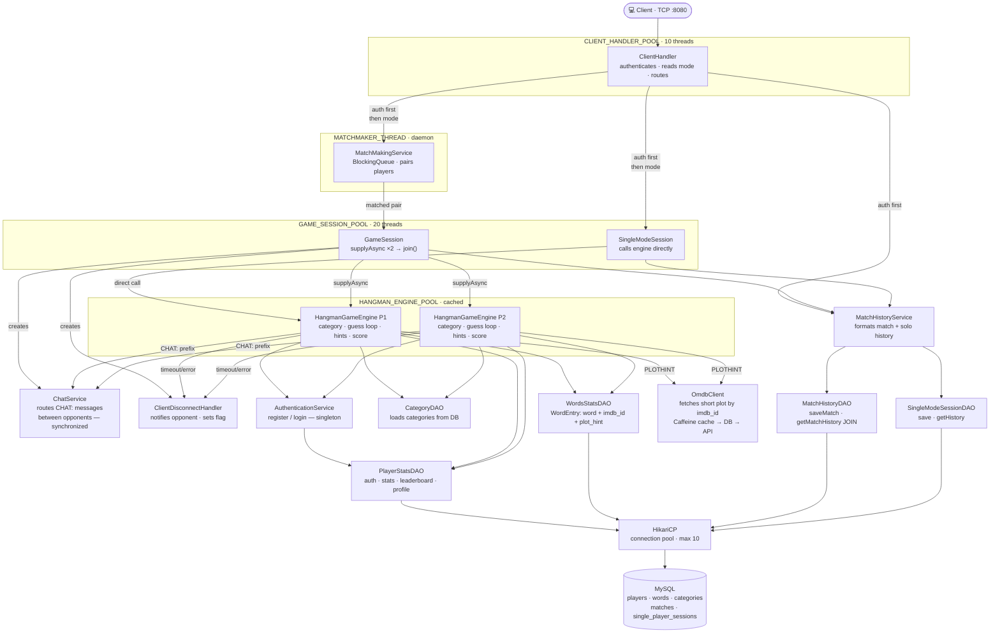

# HangmanCLI 🎮

A multiplayer terminal-based Hangman game built entirely in raw Java — no web frameworks. Uses TCP sockets, thread pools, HikariCP, and MySQL. Supports single-player, real-time 1v1 multiplayer matchmaking, persistent player accounts, time-based scoring, in-game chat, plot hints powered by the OMDb API, and a word dataset sourced from IMDb with 14 genre categories.

---

## Table of Contents

- [Features](#features)
- [Architecture](#architecture)
- [Data Pipeline](#data-pipeline)
- [Project Structure](#project-structure)
- [Database Schema](#database-schema)
- [Prerequisites](#prerequisites)
- [Setup and Installation](#setup-and-installation)
- [Running the Application](#running-the-application)
- [Gameplay](#gameplay)
- [Multiplayer Chat](#multiplayer-chat)
- [Hint System](#hint-system)
- [Protocol Reference](#protocol-reference)
- [Scoring System](#scoring-system)
- [Caching Strategy](#caching-strategy)
- [Design Decisions](#design-decisions)
- [Known Limitations](#known-limitations)

---

## Features

- **Single Player mode** — Play Hangman solo against the clock
- **Multiplayer mode** — Automatic 1v1 matchmaking; both players play simultaneously and scores are compared at the end
- **In-game Chat** — Players exchange messages with their opponent during a multiplayer game over the same TCP stream — no separate channel needed
- **Player Authentication** — Register with a username and password; returning players log in to preserve their stats
- **Persistent Stats** — `played_count`, `highest_score`, `total_score` (cumulative XP), and `total_wins` tracked per player in MySQL
- **Leaderboard** — Top 5 players ranked by total XP, with win percentage and best score as tiebreakers; viewable from the main menu or shown automatically after every game
- **Player Profile** — View your own stats including win rate, total XP, best score, and last played
- **Match History** — View your last 10 PvP matches with outcome, scores, and duration; resolved in one JOIN query (no N+1)
- **Solo Session History** — View your last 10 single-player games separately from PvP history
- **14 Word Categories** — Horror, Thriller, Sci-Fi, Mystery, Adventure, Family, Drama, Crime, Romance, Biography, Comedy, Animation, History, and Comic-Series — populated from the IMDb public dataset (50K+ votes filter) and manually curated
- **Letter Hint** — Reveal one random unrevealed letter (up to 4 per game, −5 points each)
- **Plot Hint** — Reveal a short movie plot from the OMDb API (1 per game, −15 points); lazily fetched and cached in Caffeine then persisted to DB so subsequent requests skip the API
- **Time-based Scoring** — Faster guesses earn bonus points on top of the base accuracy score
- **Hint penalty deduction** — Both hint types reduce the final score; penalty tracked per session
- **ASCII Hangman** — Full 7-frame progressive ASCII art gallows
- **Disconnect handling** — `setSoTimeout(120s)` on all sockets; opponent notified and session ends cleanly on timeout
- **OS-aware DB config** — Profile selected at startup via `-Dprofile=win|wsl|linux`; no code change needed between environments
- **Docker support** — `docker-compose.yml` wires MySQL and the server together; MySQL schema auto-loaded via `docker-entrypoint-initdb.d`

---

## Architecture

The server uses three dedicated thread pools with clear ownership to avoid thread-pool deadlocks.


```mermaid
flowchart TD
    Client(["💻 Client · TCP :8080"])

    subgraph CHP["CLIENT_HANDLER_POOL · 10 threads"]
        CH["ClientHandler\nauthenticates · reads mode · routes"]
    end

    subgraph MMT["MATCHMAKER_THREAD · daemon"]
        MM["MatchMakingService\nBlockingQueue · pairs players"]
    end

    subgraph GSP["GAME_SESSION_POOL · 20 threads"]
        SMS["SingleModeSession\ncalls engine directly"]
        GS["GameSession\nsupplyAsync ×2 → join()"]
    end

    subgraph HEP["HANGMAN_ENGINE_POOL · cached"]
        HGE1["HangmanGameEngine P1\ncategory · guess loop · hints · score"]
        HGE2["HangmanGameEngine P2\ncategory · guess loop · hints · score"]
    end

    CS["ChatService\nroutes CHAT: messages\nbetween opponents — synchronized"]
    CDH["ClientDisconnectHandler\nnotifies opponent · sets flag"]
    AUTH["AuthenticationService\nregister / login — singleton"]
    CAT["CategoryDAO\nloads categories from DB"]
    WSDAO["WordsStatsDAO\nWordEntry: word + imdb_id + plot_hint"]
    PSDAO["PlayerStatsDAO\nauth · stats · leaderboard · profile"]
    MHDAO["MatchHistoryDAO\nsaveMatch · getMatchHistory JOIN"]
    SPDAO["SingleModeSessionDAO\nsave · getHistory"]
    MHS["MatchHistoryService\nformats match + solo history"]
    OMDB["OmdbClient\nfetches short plot by imdb_id\nCaffeine cache → DB → API"]
    HCP["HikariCP\nconnection pool · max 10"]
    DB[("MySQL\nplayers · words · categories\nmatches · single_player_sessions")]

    Client      --> CH
    CH          -- "auth first\nthen mode" --> SMS
    CH          -- "auth first\nthen mode" --> MM
    CH          -- "auth first" --> MHS
    MM          -- "matched pair" --> GS
    SMS         -- "direct call" --> HGE1
    GS          -- "supplyAsync" --> HGE1
    GS          -- "supplyAsync" --> HGE2
    GS          -- "creates" --> CS
    GS          -- "creates" --> CDH
    HGE1 & HGE2 -- "CHAT: prefix" --> CS
    HGE1 & HGE2 -- "timeout/error" --> CDH
    HGE1 & HGE2 --> AUTH --> PSDAO
    HGE1 & HGE2 --> CAT
    HGE1 & HGE2 --> WSDAO
    HGE1 & HGE2 --> PSDAO
    HGE1 & HGE2 -- "PLOTHINT" --> OMDB
    GS --> MHS --> MHDAO
    SMS --> MHS --> SPDAO
    PSDAO & WSDAO & MHDAO & SPDAO --> HCP --> DB
```

**Why three pools?** `GameSession` runs on `GAME_SESSION_POOL` and submits engine tasks to `HANGMAN_ENGINE_POOL` via `CompletableFuture.supplyAsync`, then blocks with `.join()`. If both used the same pool, a saturated pool would deadlock — all threads blocking on `join()` with no threads left to run the engine tasks.

**Why cached pool for engines?** `HangmanGameEngine.run()` spends almost all its time blocked on `in.readLine()` waiting for the human to type. These are I/O-bound threads — not CPU-bound — so holding many is safe. A fixed pool would starve new games when all slots are occupied waiting for slow players.

**Why a daemon thread for the matchmaker?** The matchmaking loop blocks indefinitely on `BlockingQueue.take()`. A non-daemon thread prevents JVM shutdown even after all executor pools are stopped. With `setDaemon(true)` the JVM exits cleanly — the matchmaker is automatically killed.

**Why auth before mode selection?** Authentication happens once in `ClientHandler` before any menu option is accessible. Leaderboard, match history, and solo history all contain player-specific data — none should be reachable without authentication. The authenticated `WaitingPlayer` (with verified `id` and `username`) is passed into every downstream service, eliminating re-auth and extra queries.

**Signal-based in-band protocol:** the server sends structured signal strings on the same TCP stream as game messages. The client switches on them to know when to prompt for input vs. display text. A `CATEGORY_END` sentinel marks the end of the dynamic category list so the client never hard-codes a line count.

```
SERVER → CLIENT signals:
  INPUT_USERNAME        → client prompts for username
  INPUT_PASSWORD_NEW    → client prompts to create password
  INPUT_PASSWORD_AUTH   → client prompts to enter password
  AUTH_SUCCESS          → login/registration succeeded
  AUTH_FAILED           → wrong password, retry
  AUTH_BLOCKED          → too many failures, disconnecting
  INPUT_MODE            → client shows mode menu, reads choice
  INPUT_CATEGORY        → client reads category lines until CATEGORY_END
  CATEGORY_END          → sentinel marking end of dynamic category list
  INPUT_GUESS           → client enters game loop
  WAITING               → client shows "waiting for opponent"
  MATCH_FOUND           → client shows match banner
  CHAT_SENT             → silent ACK for sent chat message
  Ended                 → client exits read loop

CLIENT → SERVER:
  plain text            → username, password, category number, guess letter
  HINT                  → request a letter hint
  PLOTHINT              → request a plot hint (OMDb)
  CHAT:<message>        → send chat message to opponent
```

---

## Data Pipeline

Word data is sourced from the IMDb public dataset, not from a static SQL file.

```
IMDb title.basics.tsv.gz   →  IMDbStagingETL.java
IMDb title.ratings.tsv.gz  →     (batch ETL, run once)
         │
         ▼
   words_staging table      ← raw candidates filtered to:
   (tconst, title,              - titleType = "movie"
    genres, rating, votes)      - isAdult = 0
                                - numVotes ≥ 50,000
         │
         ▼ SQL genre → category mapping
   words table               ← top 200 per category by num_votes
   (wordId, word,                14 categories populated
    category_id, imdb_id,        Comic-Series seeded manually
    plot_hint,                   (not an IMDb genre tag)
    popularity_votes)
         │
         ▼ on PLOTHINT request
   OmdbClient                ← fetches short plot by imdb_id
   Caffeine cache             → persists to words.plot_hint
   (imdb_id → plot string)      subsequent requests skip API
```

The word list is **not committed to GitHub**. Users run the ETL against the publicly available IMDb dataset (freely downloadable from datasets.imdbws.com) and populate the `words` table themselves. The schema and ETL code are provided — the data is not.

---

## Project Structure

```
src/
├── client/
│   └── GameClient.java                 # Terminal client — signal-driven read loop
├── dao/
│   ├── CategoryDAO.java                # Loads categories from DB (ordered by id)
│   ├── MatchHistoryDAO.java            # saveMatch · getMatchHistory with JOIN
│   ├── PlayerStatsDAO.java             # Auth (register/login/id) + stats CRUD
│   ├── SingleModeSessionDAO.java       # save · getHistory for solo sessions
│   ├── WordEntry.java                  # Record: wordId, word, imdbId, plotHint
│   └── WordsStatsDAO.java              # Random WordEntry by category + savePlotHint
├── etl/
│   └── IMDbStagingETL.java             # One-time batch job: IMDb TSV → words_staging
├── model/
│   ├── Category.java                   # Record: id, name
│   ├── MatchHistory.java               # Record: match result DTO
│   ├── PlayerResult.java               # Record: username, score, status, attempts, seconds
│   ├── PlayerStats.java                # Record: full player record from DB
│   ├── SinglePlayerSession.java        # Record: solo session DTO
│   ├── Status.java                     # Enum: WIN, LOSE, DRAW, NOTHING
│   └── WaitingPlayer.java              # Socket + username + playerId
├── service/
│   ├── AuthenticationService.java      # Singleton: register / login, sets playerId
│   ├── ChatService.java                # Routes CHAT: messages — synchronized
│   ├── ClientDisconnectHandler.java    # Notifies opponent on timeout — volatile flag
│   ├── ClientHandler.java              # Auth → mode selection → routing
│   ├── GameServer.java                 # Entry point; ServerSocket accept loop
│   ├── GameSession.java                # Multiplayer: parallel engines, result, history
│   ├── HangmanGameEngine.java          # Core game loop: category, guess, hints, score
│   ├── MatchHistoryService.java        # Formats PvP + solo history; delegates to DAOs
│   ├── MatchMakingService.java         # Daemon thread; BlockingQueue pairs players
│   ├── Session.java                    # Marker interface (extends Runnable)
│   └── SingleModeSession.java          # Solo wrapper: engine → history → leaderboard
└── util/
    ├── DBConfigProperties.java         # POJO: DB URL / user / password
    ├── HikariConnectionManager.java    # Static HikariDataSource factory (pool 10)
    ├── JDBConnectionManager.java       # Legacy DriverManager (retained for reference)
    ├── LeaderboardPrinter.java         # Top-N table with XP, wins, win% over PrintWriter
    ├── OmdbClient.java                 # Caffeine cache → DB → OMDb API for plot hints
    ├── PasswordUtil.java               # SHA-256 hash + verify
    ├── ProfilePrinter.java             # Player profile table over PrintWriter
    └── PropertyLoaderUtil.java         # Loads db-<profile>-config.properties

resources/
├── db-win-config.properties            # Windows DB credentials  — gitignored
└── db-wsl-config.properties            # WSL/Linux credentials   — gitignored

init/
└── 01-schema.sql                       # Full schema — used by Docker entrypoint
```

---

## Database Schema

```sql
CREATE TABLE players (
    id            INT PRIMARY KEY AUTO_INCREMENT,
    username      VARCHAR(50)  NOT NULL UNIQUE,
    password_hash VARCHAR(64)  NOT NULL,
    played_count  INT          NOT NULL DEFAULT 0,
    highest_score INT          NOT NULL DEFAULT 0,
    total_score   INT          NOT NULL DEFAULT 0,
    total_wins    INT          NOT NULL DEFAULT 0,
    last_played   TIMESTAMP    NOT NULL
);

CREATE TABLE categories (
    id            INT PRIMARY KEY AUTO_INCREMENT,
    category_name VARCHAR(50)  NOT NULL UNIQUE
);

CREATE TABLE words (
    wordId            INT PRIMARY KEY AUTO_INCREMENT,
    word              VARCHAR(100) NOT NULL,
    category_id       INT NOT NULL REFERENCES categories(id),
    imdb_id           VARCHAR(20),          -- tconst e.g. tt0816692
    plot_hint         TEXT,                 -- lazily fetched from OMDb, cached here
    hint_fetched_at   TIMESTAMP,
    popularity_votes  INT,
    INDEX idx_words_category (category_id)
);

CREATE TABLE words_staging (
    tconst          VARCHAR(20) PRIMARY KEY,
    primary_title   VARCHAR(255),
    genres          VARCHAR(100),
    average_rating  DECIMAL(3,1),
    num_votes       INT
);

CREATE TABLE matches (
    id                       INT PRIMARY KEY AUTO_INCREMENT,
    player1_id               INT NOT NULL REFERENCES players(id),
    player2_id               INT NOT NULL REFERENCES players(id),
    winner_id                INT REFERENCES players(id),   -- NULL = draw
    player1_score            INT NOT NULL,
    player2_score            INT NOT NULL,
    player1_duration_seconds INT NOT NULL,
    player2_duration_seconds INT NOT NULL,
    result    ENUM('player1_win','player2_win','draw') NOT NULL,
    played_at TIMESTAMP DEFAULT CURRENT_TIMESTAMP,
    INDEX idx_matches_player1   (player1_id),
    INDEX idx_matches_player2   (player2_id),
    INDEX idx_matches_winner    (winner_id),
    INDEX idx_matches_played_at (played_at)
);

CREATE TABLE single_player_sessions (
    id               INT PRIMARY KEY AUTO_INCREMENT,
    player_id        INT NOT NULL REFERENCES players(id),
    score            INT NOT NULL,
    wrong_attempts   INT NOT NULL,
    duration_seconds INT NOT NULL,
    won              BOOLEAN NOT NULL,
    played_at        TIMESTAMP DEFAULT CURRENT_TIMESTAMP,
    INDEX idx_sps_player (player_id)
);
```

---

## Prerequisites

| Requirement | Version |
|---|---|
| Java | 17 or higher |
| MySQL | 8.0.19 or higher |
| MySQL Connector/J | 9.x (JAR in `lib/`) |
| HikariCP | 5.x (JAR in `lib/`) |
| SLF4J API + Simple | 2.x (JAR in `lib/`, required by HikariCP) |
| Caffeine | 3.x (JAR in `lib/`) |
| Jackson Databind | 2.x (JAR in `lib/`, used by OmdbClient) |
| OMDb API key | Free at omdbapi.com — 1000 req/day |

---

## Setup and Installation

**1. Clone the repository**
```bash
git clone https://github.com/kishores046/HangmanCLI.git
cd HangmanCLI
```

---

**2. Add JARs to the project**

All JARs live in `lib/`. Add them all as dependencies.

<details>
<summary><b>IntelliJ IDEA</b></summary>

```
File → Project Structure (Ctrl+Alt+Shift+S)
  → Modules → Dependencies tab
  → click "+" → JARs or directories
  → select all JARs in lib/
  → OK → Apply → OK
```

</details>

<details>
<summary><b>Eclipse</b></summary>

```
Right-click project → Build Path → Configure Build Path
  → Libraries tab → Add External JARs...
  → select all JARs in lib/ → Open → Apply and Close
```

</details>

---

**3. Create the database and schema**

```bash
mysql -u root -p < init/01-schema.sql
```

---

**4. Populate word data (IMDb ETL)**

Download the IMDb dataset files from [datasets.imdbws.com](https://datasets.imdbws.com):
- `title.basics.tsv.gz`
- `title.ratings.tsv.gz`

Update the file paths in `IMDbStagingETL.java`, then run it as a Java application. It stages ~5,000+ candidate titles into `words_staging`. Then run the SQL genre-mapping inserts to populate the `words` table (see `init/02-populate-words.sql` for the full set of inserts).

---

**5. Configure environment**

Create the file matching your profile. Both are gitignored — never commit them.

```properties
# resources/db-win-config.properties  (Windows native MySQL)
# resources/db-wsl-config.properties  (WSL / Linux MySQL)
DB_URL      = jdbc:mysql://localhost:3306/hangman
DB_USER     = root
DB_PASSWORD = your_password_here
```

Set the OMDb API key as an environment variable:
```bash
# Windows
set OMDB_API_KEY=your_key_here

# Linux / WSL / macOS
export OMDB_API_KEY=your_key_here
```

Mark `resources/` as a Resources Root (IntelliJ) or Source Folder (Eclipse) so properties files are on the classpath.

---

**6. Build**

<details>
<summary><b>IntelliJ IDEA</b></summary>

`Ctrl+F9` or `Build → Build Project`. Output to `out/production/HangManGame/`.

</details>

<details>
<summary><b>Eclipse</b></summary>

Builds automatically on save. Force rebuild: `Project → Clean → Clean all projects → OK`. Output to `bin/`.

</details>

---

## Running the Application

> ⚠️ **Password visibility in IDEs:** `System.console()` returns `null` inside IDE consoles — password input is visible as plain text. Run from a real terminal to hide it.

**Start the server:**

```bash
# Windows (default profile)
java -Dprofile=win -cp "out;lib/*" service.GameServer

# WSL / Linux
java -Dprofile=wsl -cp "out:lib/*" service.GameServer
```

**Start one or more clients:**

```bash
# Default — connects to localhost:8080
java -cp "out;lib/*" client.GameClient

# Remote server
java -cp "out;lib/*" client.GameClient your-server-ip 8080
```

For multiplayer, open two terminal windows and run the client command in each. Both choose option **2 (Multi Player)** — the matchmaker pairs them automatically.

---

**Docker (server + MySQL together):**

```bash
# First start — builds image and loads schema automatically
docker compose up --build

# Subsequent starts
docker compose up

# Stop (data preserved)
docker compose down

# Stop and wipe all data
docker compose down -v
```

---

## Gameplay

```
Enter your username: alice
Username 'alice' is available! Create a password:
Password (hidden): ••••••••
Account created! Welcome, alice!

Choose mode:
  1: Single Player
  2: Multi Player
  3: Leaderboard
  4: Match History (PvP)
  5: Solo History
  6: Player Profile
> 1

Welcome alice! Let's play Hangman.
Choose your category:
  1. Action-Movies
  2. Thriller-Movies
  3. SciFi-Movies
  4. Horror-Movies
  ...
Enter 1-14:
> 3

   +---+        Word: _ _ _ _ _ _ _ _ _ _ _
                Wrong attempts: 0/6

Your guess (letter / HINT / PLOTHINT / CHAT:msg): p
Word: _ _ _ _ _ _ _ _ _ _ _   ← no match
Wrong attempts: 1/6

Your guess: i
Word: i _ _ _ _ _ _ _ _ _ _
...
Congratulations alice! You guessed the word: interstellar
Your score: 87
```

**Authentication flow:**
- New username → create password → account registered instantly
- Returning username → enter password → up to 3 attempts → blocked after 3 failures

---

## Multiplayer Chat

Players send messages to their opponent at any point during a multiplayer game without affecting game flow.

```
Your guess (letter / HINT / PLOTHINT / CHAT:msg): CHAT:good luck!
```

The opponent sees:
```
[[CHAT]] alice: good luck!
```

`ChatService.route()` is `synchronized` — if both players send chat simultaneously, lines never interleave. The `[[CHAT]]` prefix lets the client distinguish chat from game messages. Single-player games pass `null` for `chatService`; the null check in the engine means zero overhead for solo games.

---

## Hint System

Two hint types are available during any game:

| Command | Effect | Limit | Penalty |
|---|---|---|---|
| `HINT` | Reveals one random unrevealed letter | 4 per game | −5 points each |
| `PLOTHINT` | Shows a short plot summary from OMDb | 1 per game | −15 points |

**How plot hints work:**

```
Player types PLOTHINT
       │
       ▼
Caffeine cache (imdb_id → plot string)
  hit  → return immediately (<1ms)
  miss ↓
DB words.plot_hint column
  populated → return, populate cache
  null ↓
OMDb API call (imdb_id → short plot)
  success → sanitize to 20 words → save to DB → cache → return
  fail    → "Plot hint unavailable right now."
```

The plot is sanitized to 20 words maximum before being sent to the player — enough context without revealing too much. Once fetched, it is persisted to the `words` table so future requests for the same word skip the API entirely.

---

## Protocol Reference

| Signal | Direction | Meaning |
|---|---|---|
| `INPUT_USERNAME` | Server → Client | Prompt for username |
| `INPUT_PASSWORD_NEW` | Server → Client | Prompt to create password (new user) |
| `INPUT_PASSWORD_AUTH` | Server → Client | Prompt to enter password (returning user) |
| `AUTH_SUCCESS` | Server → Client | Login or registration succeeded |
| `AUTH_FAILED` | Server → Client | Wrong password — retry |
| `AUTH_BLOCKED` | Server → Client | Too many failures — disconnecting |
| `INPUT_MODE` | Server → Client | Show mode menu, read choice |
| `INPUT_CATEGORY` | Server → Client | Read category lines until `CATEGORY_END` |
| `CATEGORY_END` | Server → Client | Sentinel — end of dynamic category list |
| `INPUT_GUESS` | Server → Client | Client enters the game loop |
| `WAITING` | Server → Client | Queued for multiplayer — waiting for opponent |
| `MATCH_FOUND` | Server → Client | Opponent found; game starting |
| `CHAT_SENT` | Server → Client | Silent ACK — chat delivered to opponent |
| `Ended` | Server → Client | Session complete; client breaks read loop |
| `HINT` | Client → Server | Request a letter hint |
| `PLOTHINT` | Client → Server | Request a plot hint (OMDb) |
| `CHAT:<msg>` | Client → Server | Send chat message to opponent |
| `[[CHAT]]user: msg` | Server → Client | Incoming chat from opponent |

---

## Scoring System

```
Base score   = (MAX_ATTEMPTS − wrongAttempts) × 10
Time bonus   = max(0, 60 − elapsedSeconds)
Hint penalty = (hintsUsed × 5) + (plotHintsUsed × 15)
Final score  = base score + time bonus − hint penalty
```

Maximum possible score (no wrong answers, under 60s, no hints) = `60 + 60 = 120`.

The leaderboard orders by `total_score DESC`, then `highest_score DESC`, then `win_percentage DESC` — rewarding consistent play, peak performance, and win rate in that order.

---

## Caching Strategy

| Cache | Implementation | TTL | Max size | What it holds |
|---|---|---|---|---|
| Plot hints | Caffeine | 6 hours | 500 | `imdb_id → short plot string` |

Plot hints are the only data cached in memory. Leaderboard and category data are not cached — with HikariCP and a warm connection pool, these queries complete in under 5ms and caching would add complexity for no measurable benefit at the current user scale.

The Caffeine cache is backed by the DB: a cache miss checks `words.plot_hint` before calling the OMDb API. A successful API call writes back to the DB so the cache survives server restarts (the next warm-up is a DB read, not an API call).

---

## Design Decisions

**Why raw TCP sockets over HTTP?**
Built to learn Java networking fundamentals from scratch — socket lifecycle, stream framing, connection threading, protocol design. Spring Boot would have hidden all of this.

**Why three executor pools?**
`GameSession` runs on `GAME_SESSION_POOL`, calls `CompletableFuture.supplyAsync(..., HANGMAN_ENGINE_POOL)`, then blocks on `.join()`. If both used the same pool, all threads would block on `join()` waiting for engine tasks that can never be scheduled — classic thread-pool deadlock. Separating pools by responsibility eliminates this entirely.

**Why a cached pool for engines?**
`HangmanGameEngine.run()` is almost entirely `in.readLine()` — waiting for a human to type. I/O-bound blocking threads don't compete for CPU, so a large number of them is safe. A fixed pool would artificially cap concurrent games even when threads are idle.

**Why auth before mode selection?**
Leaderboard, match history, and profile all contain player-specific data. Moving auth to `ClientHandler` means it happens once before any feature is accessible. The authenticated `WaitingPlayer` carries a verified `id` — downstream services never re-query for the player's identity.

**Why carry `id` on `WaitingPlayer`?**
`MatchHistoryDAO.saveMatch()` needs player IDs to insert FK references into the `matches` table. Fetching IDs separately after the game would be two extra queries per match. Setting `id` on `WaitingPlayer` during auth means the ID travels through the session for free.

**Why `BlockingQueue` for matchmaking?**
`LinkedBlockingQueue.take()` blocks cleanly until two players are available — no polling, no `Thread.sleep()`. Daemon thread means it never prevents JVM shutdown.

**Why HikariCP instead of raw `DriverManager`?**
Raw `DriverManager.getConnection()` opens and closes a TCP connection to MySQL on every call. Under multiplayer load this creates dozens of connections per second. HikariCP maintains a warm pool of 10 connections and hands them out in microseconds, with automatic validation, leak detection, and stale-connection eviction.

**Why `DataSource` injected into DAOs?**
A DAO that calls `HikariConnectionManager.getDataSource()` internally is untestable without reflection. Passing `DataSource` through the constructor means any `DataSource` (including an in-memory H2 pool) can be substituted in tests.

**Why Caffeine for plot hints?**
The OMDb API is called at most once per unique word ever — after that, the plot is in the DB and the cache. Without caching, two players guessing the same word simultaneously would both trigger an API call. Caffeine collapses concurrent misses and makes subsequent lookups sub-millisecond.

**Why `synchronized` on `ChatService.route()`?**
`PrintWriter.println()` is synchronized per character, but two rapid calls from different engine threads can still interleave at the line level. Synchronizing the whole method prevents `[[CHAT]]alice:` and `[[CHAT]]bob:` from garbling each other on the recipient's screen.

**Why IMDb dataset instead of a live API?**
TMDb is geo-blocked in India. The IMDb public dataset (freely available at datasets.imdbws.com) is downloadable once, processed by the ETL job, and filtered to 50K+ vote movies — giving thousands of high-quality, well-known movie titles across 14 genres with zero ongoing API dependency.

**Why SHA-256 for passwords?**
No external libraries beyond HikariCP and the MySQL driver are required at runtime. SHA-256 is in the Java standard library and is sufficient for a learning project. Production would use BCrypt or Argon2.

**Why profile-based DB config files?**
Developed on both Windows (MySQL as a native service) and WSL (MySQL started manually as a Linux service). The two environments differ in host and socket path. `-Dprofile=win|wsl|linux` selects the right file at startup — the same pattern Spring uses for environment profiles, applied manually here.

---

## Known Limitations

- **No SSL/TLS** — passwords travel as plaintext before hashing server-side; a production deployment requires TLS termination (Nginx `stream` block + Let's Encrypt)
- **No reconnection with game resume** — a token system could skip re-auth on reconnect, but without persisting game state to DB, the game itself cannot be resumed; opponent is notified and session ends cleanly via `ClientDisconnectHandler`
- **Password visible in IDEs** — `System.console()` returns `null` in IDE run configurations; use a real terminal for hidden input
- **Single server instance** — all state is in-JVM; horizontal scaling would require externalizing the matchmaking queue (e.g. Redis) and session state
- **Chat is in-band and ephemeral** — no history, no persistence, no offline messaging
- **OMDb free tier** — 1,000 API calls/day; Caffeine + DB persistence mean real usage is well under this limit, but a popular server could exhaust it
- **IMDb word normalization strips spaces** — "The Dark Knight" becomes "TheDarkKnight"; the display currently shows the normalized form; showing the original spaced title with underscores revealed per-word is a planned improvement
