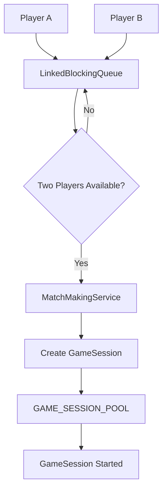
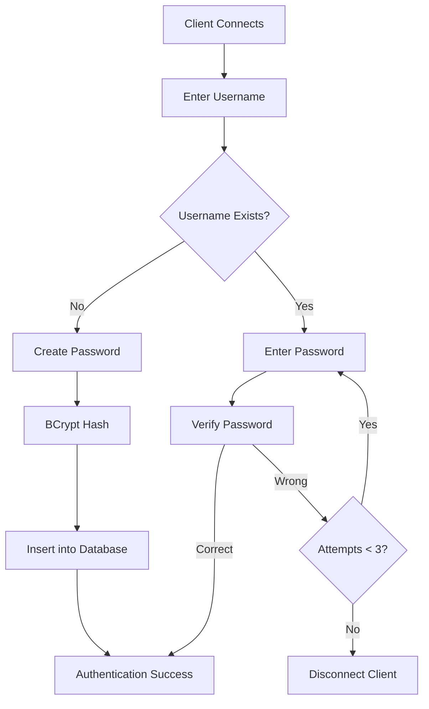
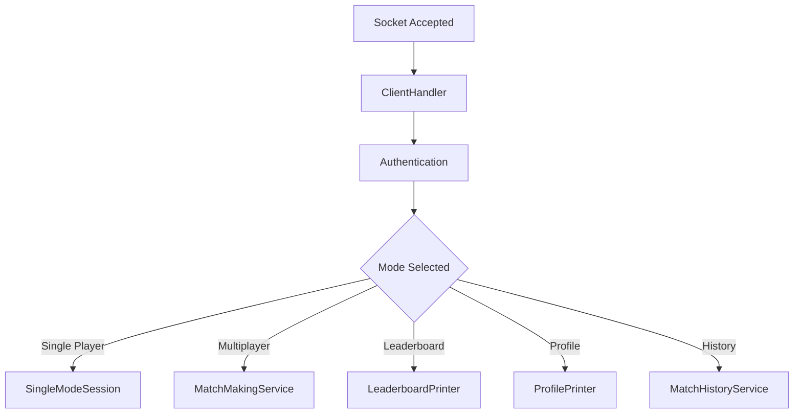
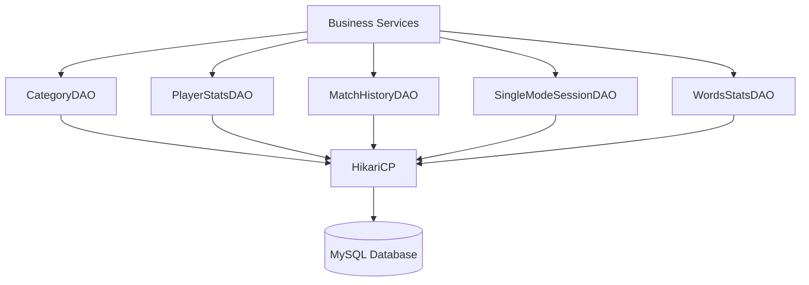
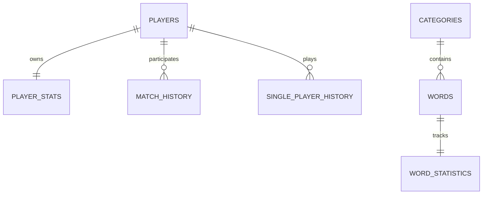
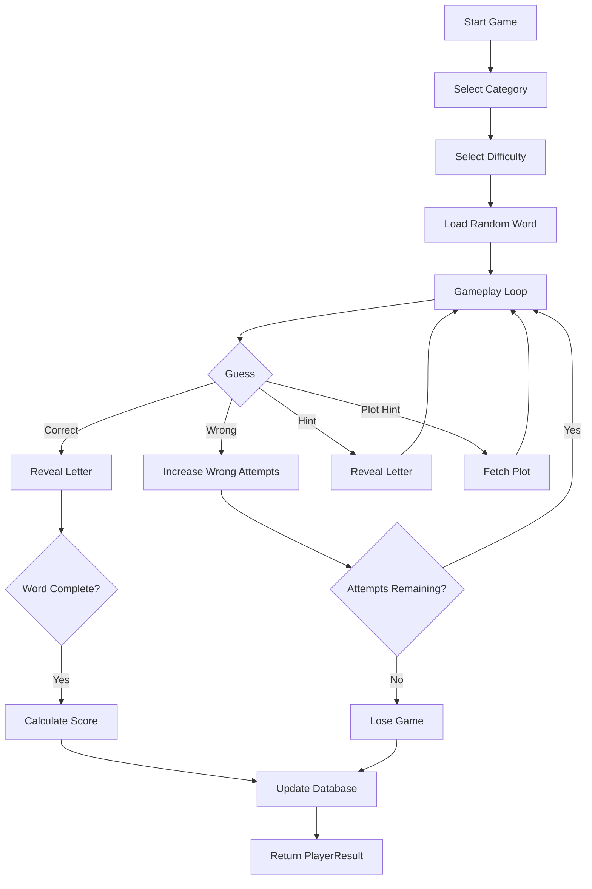
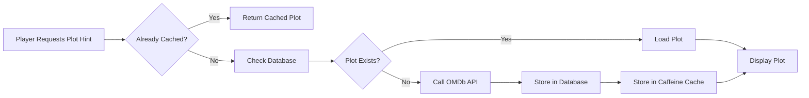
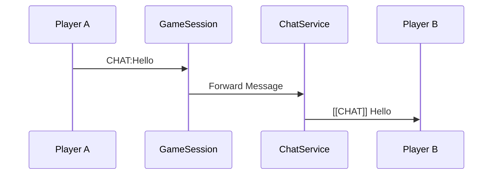
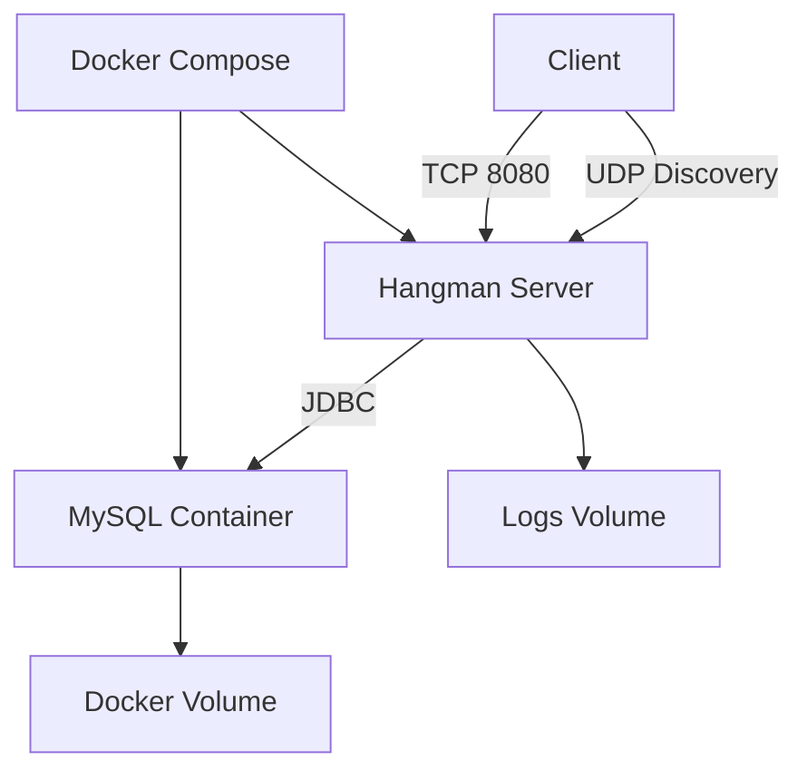
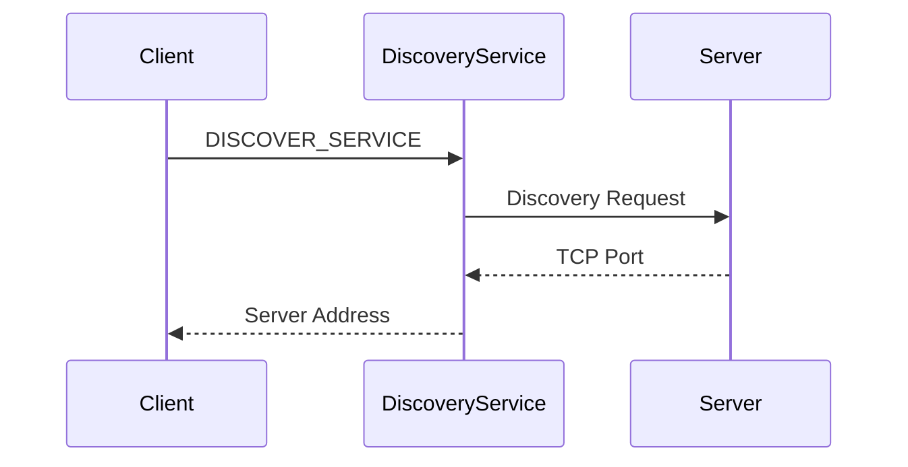

# 🎮 HangmanCLI


A **multiplayer terminal-based Hangman game** implemented entirely using **Core Java**, **TCP sockets**, **multithreading**, and **MySQL**.

Unlike typical Hangman games that rely on web frameworks or game engines, this project demonstrates how distributed multiplayer systems can be built directly using Java networking APIs, thread pools, connection pooling, and a custom application protocol.

The project supports:

- 🎯 Single Player Mode
- ⚔️ Multiplayer Matchmaking
- 💬 Real-time Chat
- 🔐 Secure Authentication (BCrypt)
- 🏆 Persistent Leaderboards
- 📈 Player Profiles
- 📜 Match History
- 🎬 Movie Plot Hints using OMDb API
- 🐳 Docker Deployment
- ⚡ HikariCP Connection Pooling

---

## ⚡ Quick Start

Fastest way to try it out, using Docker:

```bash
git clone https://github.com/kishores046/HangmanCLI.git
cd HangmanCLI
cp .env.example .env    # fill in your OMDb API key and DB credentials
docker compose up --build
```

The client (`HangmanClient`) lives in its own repository — see [HangmanClient](https://github.com/<your-username>/HangmanClient) for build/run instructions. It connects to this server either via LAN auto-discovery (UDP) or by pointing directly at the server's public IP.

> **Production server:** the hosted instance runs on an AWS EC2 instance behind a static Elastic IP, so clients connecting over the internet should use that address directly rather than relying on LAN discovery, which only works on the same local network as the server.

For a manual (non-Docker) server setup, see [Running Without Docker](#running-without-docker).

---

## Table of Contents

- [Features](#features)
- [Technology Stack](#technology-stack)
- [Architecture Overview](#architecture-overview)
- [Threading Architecture](#threading-architecture)
- [Project Structure](#project-structure)
- [Package Overview](#package-overview)
- [Connection Abstraction](#connection-abstraction)
- [Client Authentication](#client-authentication)
- [Design Principles Used](#design-principles-used)
- [Data Access Layer (DAO)](#data-access-layer-dao)
- [Database Schema](#database-schema)
- [HikariCP Connection Pool](#hikaricp-connection-pool)
- [Game Engine](#game-engine)
- [Scoring System](#scoring-system)
- [Multiplayer Session](#multiplayer-session)
- [Chat Service](#chat-service)
- [Communication Protocol](#communication-protocol)
- [UDP Discovery](#udp-discovery)
- [Installation](#installation)
- [Docker Deployment](#docker-deployment)
- [Error Handling](#error-handling)
- [Performance Optimizations](#performance-optimizations)
- [Security Features](#security-features)
- [Roadmap](#roadmap)
- [Contributing](#contributing)
- [License](#license)

---

## Features

### 🎮 Game Modes

**Single Player** — play Hangman against the computer.

- Difficulty Selection
- Category Selection
- Score Calculation
- Hint System
- Plot Hint System
- Persistent Match History

**Multiplayer** — two players are automatically matched through a dedicated matchmaking service.

Both players receive:

- same game rules
- independent gameplay
- simultaneous execution

After completion:

- scores are compared
- winner announced
- leaderboard updated
- match stored permanently

---

### 🔐 Authentication

Supports both

- New User Registration
- Existing User Login

Security features:

- BCrypt password hashing
- Automatic SHA-256 migration for legacy accounts
- Maximum login attempts
- Authentication before entering any game mode

---

### 🏆 Leaderboard

The server maintains persistent rankings, based on:

1. Total Score
2. Highest Score
3. Win Percentage

Displayed after multiplayer games, single player games, and via the leaderboard menu option.

---

### 👤 Player Profile

Every registered player has a persistent profile, including:

- Username
- Total XP
- Highest Score
- Games Played
- Wins
- Win Percentage
- Last Played

---

### 📜 Match History

Two independent history systems.

**Multiplayer History** stores: opponent, winner, scores, duration, result, timestamp.

**Single Player History** stores: score, duration, wrong attempts, win/loss, played time.

---

### 🎬 OMDb Plot Hint

Every movie word may contain an IMDb ID. Instead of revealing the answer directly, the server fetches a short plot summary from the OMDb API.

Features:

- Lazy loading
- Database persistence
- Caffeine cache
- Automatic fallback

Repeated requests never call the API again.

---

### 💬 Multiplayer Chat

Players can communicate while playing.

```
CHAT:Good luck!
```

Opponent receives:

```
[[CHAT]]
Alice:
Good luck!
```

The chat system shares the same TCP connection used by the game — no separate socket required.

---

### 🎯 Hint System

Two kinds of hints are supported.

| Hint Type | Effect | Limit | Penalty |
|-----------|--------|-------|---------|
| Letter Hint | Reveals one random letter | Max 4 per game | -5 pts each |
| Plot Hint | Fetches movie description | Max 1 per game | -15 pts |

---

### 📂 Categories

Players first choose a category, e.g. Action, Horror, Comedy, Drama, Crime, Sci-Fi, Adventure, Animation, Mystery, Romance.

Categories are loaded dynamically from MySQL.

---

### 🎚 Difficulty Levels

| Difficulty | Attempts |
|------------|---------:|
| Easy | 8 |
| Medium | 6 |
| Hard | 4 |

---

### 🐳 Docker Support

Project includes a `Dockerfile` and `docker-compose.yml`.

```bash
docker compose up
```

starts MySQL and the Hangman Server without installing MySQL manually.

---

### 📡 UDP Discovery

Clients can automatically discover the server. The discovery service listens on UDP and responds with the TCP server port — no manual IP configuration is required on local networks.

---

### ⚡ High Performance

Optimizations include:

- HikariCP Connection Pool
- Caffeine Cache
- ExecutorService Thread Pools
- CompletableFuture
- Prepared Statements
- Connection Reuse

---

## Technology Stack

| Category | Technology |
|------------|------------|
| Language | Java 21 |
| Networking | TCP Sockets |
| Discovery | UDP |
| Database | MySQL 9 |
| Build Tool | Maven |
| Connection Pool | HikariCP |
| Cache | Caffeine |
| JSON Parsing | Jackson |
| Authentication | BCrypt |
| API | OMDb |
| Containerization | Docker |
| Logging | java.util.logging |

---

## Architecture Overview

```mermaid
flowchart TD

    A[ServerSocket.accept()] --> B[CLIENT_HANDLER_POOL]

    B --> C[ClientHandler]

    C --> D[AuthenticationService]

    D --> E{Choose Mode}

    E -->|Single Player| F[SingleModeSession]

    E -->|Multiplayer| G[MatchMakingService]

    E -->|Leaderboard| H[LeaderboardPrinter]

    E -->|Profile| I[ProfilePrinter]

    E -->|History| J[MatchHistoryService]

    G --> K[Waiting Queue]

    K --> L[GAME_SESSION_POOL]

    L --> M[GameSession]

    M --> N[CompletableFuture]

    N --> O[HANGMAN_ENGINE_POOL]

    F --> O

    O --> P[HangmanGameEngine]

    P --> Q[DAO Layer]

    Q --> R[HikariCP]

    R --> S[(MySQL)]
```

---

## Threading Architecture

The server uses **multiple executor services**, each dedicated to a specific responsibility.

### CLIENT_HANDLER_POOL

Responsible for accepting client requests, authentication, menu navigation, and dispatching sessions. Each connected client gets its own handler.

### GAME_SESSION_POOL

Responsible for both multiplayer and single-player sessions. Each session executes independently.

### HANGMAN_ENGINE_POOL

Runs the core Hangman engine. Isolates game execution, prevents matchmaking delays, and allows simultaneous games.

### Matchmaking Thread

A dedicated daemon thread continuously waits for players.


```mermaid
flowchart TB

    A[Player A]
    B[Player B]

    A --> C[LinkedBlockingQueue]
    B --> C

    C --> D{Two Players Available?}

    D -->|No| C

    D -->|Yes| E[MatchMakingService]

    E --> F[Create GameSession]

    F --> G[GAME_SESSION_POOL]

    G --> H[GameSession Started]
```

The matchmaking algorithm uses `LinkedBlockingQueue`, ensuring thread safety, FIFO ordering, and automatic blocking until two players become available.

---

## Design Goals

The project was designed to demonstrate real-world backend engineering concepts rather than simply implementing a Hangman game.

Primary goals include:

- Object-Oriented Design
- Clean Separation of Concerns
- Network Programming
- Concurrent Programming
- Connection Pooling
- Database Persistence
- Secure Authentication
- Docker Deployment
- Modular Architecture
- Extensibility for future clients (GUI/Web)

---

## Project Structure

The project follows a layered architecture that separates networking, business logic, persistence, domain models, and utilities into dedicated packages. This separation improves maintainability, readability, and future extensibility.

```
HangmanCLI
│
├── db/
│   ├── schema.sql
│   ├── sample-seed.sql
│   └── words.sql
│
├── logs/
│
├── src/
│   ├── dao
│   ├── model
│   ├── service
│   │   └── connection
│   ├── util
│   └── resources
│
├── docker-compose.yml
├── Dockerfile
├── pom.xml
├── README.md
└── .env
```

| Package | Responsibility |
|----------|----------------|
| `dao` | Database access using JDBC and HikariCP |
| `model` | Domain models and records |
| `service` | Business logic and networking |
| `service.connection` | TCP communication abstraction |
| `util` | Helper classes, caching, configuration, logging |
| `resources` | Logging configuration |

---

## Package Overview

### DAO Layer

Responsible for all database operations.

```
dao
│
├── CategoryDAO
├── MatchHistoryDAO
├── PlayerStatsDAO
├── SingleModeSessionDAO
├── WordsStatsDAO
└── WordEntry
```

Responsibilities include Player Authentication, Leaderboard, Match History, Categories, Words, Profiles, and Statistics. The service layer never executes SQL directly.

---

### Model Layer

Contains immutable domain objects.

```
model
│
├── Category
├── MatchHistory
├── PlayerResult
├── PlayerStats
├── SinglePlayerSession
├── WaitingPlayer
└── Status
```

Java Records are used wherever possible to reduce boilerplate and improve readability.

---

### Service Layer

Contains the application's business logic.

```
service
│
├── AuthenticationService
├── ChatService
├── ClientDisconnectHandler
├── ClientHandler
├── DiscoveryService
├── GameSession
├── GameTcpServer
├── HangmanGameEngine
├── MatchHistoryService
├── MatchMakingService
├── Session
└── SingleModeSession
```

This package coordinates networking, authentication, matchmaking, gameplay, scoring, history, leaderboard, and profiles.

---

### Connection Layer

```
service.connection
│
├── ClientConnection
├── ClientContext
└── TcpConnection
```

This abstraction completely separates networking code from business logic.

---

### Utility Layer

```
util
│
├── DBConfigProperties
├── HikariConnectionManager
├── JDBConnectionManager
├── LeaderboardPrinter
├── OmdbClient
├── PasswordUtil
├── ProfilePrinter
└── PropertyLoaderUtil
```

Responsibilities: password hashing, connection pool, logging, OMDb API, profile printing, leaderboard printing, and environment variables.

---

## Connection Abstraction

One of the biggest architectural improvements in the project is the introduction of a communication abstraction.

Instead of coupling the application directly with `PrintWriter` / `BufferedReader`, all communication now happens through `ClientConnection`.

### Why?

Initially, many services depended directly on `PrintWriter`:

```
GameEngine → PrintWriter.println()
```

This tightly coupled business logic with TCP sockets. Changing the communication mechanism would require modifications across multiple classes.

### New Architecture

```
GameEngine
      │
      ▼
ClientConnection
      │
      ▼
TcpConnection
      │
      ▼
ClientContext
      │
      ▼
PrintWriter / BufferedReader
```

Now every service only depends on `ClientConnection` instead of low-level socket streams.

### Benefits

**Loose Coupling** — business logic no longer knows about `PrintWriter`, `BufferedReader`, or `Socket`. It only knows `ClientConnection`.

**Easy Testing** — a mock implementation (`MockConnection`) can store messages and assert results without opening sockets.

**Future Expansion** — a future implementation (`WebSocketConnection`, `JsonConnection`, `EncryptedConnection`) can be added without modifying the game engine, as long as it implements `ClientConnection`.

---

## Client Authentication

Authentication is handled by a dedicated singleton service, `AuthenticationService`, which supports Registration, Login, and Password Migration.

### Authentication Flow


```mermaid
flowchart TD

A[Client Connects]

A --> B[Enter Username]

B --> C{Username Exists?}

C -->|No| D[Create Password]

D --> E[BCrypt Hash]

E --> F[Insert into Database]

F --> G[Authentication Success]

C -->|Yes| H[Enter Password]

H --> I[Verify Password]

I -->|Correct| G

I -->|Wrong| J{Attempts < 3?}

J -->|Yes| H

J -->|No| K[Disconnect Client]
```

**Registration** — when a username does not exist, the server asks for a password, hashes it using BCrypt, stores the hash, and creates player statistics.

**Login** — returning users enter a password, BCrypt verifies it, the player ID is loaded, and the session continues.

**Legacy Password Support** — older SHA-256 passwords are automatically migrated to BCrypt on next successful login. No manual migration is required.

### Password Security

Passwords are **never stored in plaintext**. The server stores only a BCrypt hash (e.g. `$2a$12$...`). Even if the database is leaked, original passwords cannot be recovered.

### WaitingPlayer

After successful authentication, the server creates a `WaitingPlayer`, which stores the Socket, Username, Player ID, and ClientConnection. The authenticated player object travels through the entire application (Authentication → WaitingPlayer → Matchmaking → GameSession → HangmanGameEngine), reducing unnecessary database queries.

### Client Handler

Each client connection is managed by its own `ClientHandler`, responsible for username input, authentication, mode selection, and session routing. It does **not** play the game, calculate scores, or update the database — those responsibilities belong to dedicated services.


```mermaid
flowchart TD

A[Socket Accepted]

A --> B[ClientHandler]

B --> C[Authentication]

C --> D{Mode Selected}

D -->|Single Player| E[SingleModeSession]

D -->|Multiplayer| F[MatchMakingService]

D -->|Leaderboard| G[LeaderboardPrinter]

D -->|Profile| H[ProfilePrinter]

D -->|History| I[MatchHistoryService]
```

---

## Design Principles Used

**Single Responsibility Principle** — each class has one responsibility (e.g. `AuthenticationService` → authentication, `ChatService` → chat routing, `MatchMakingService` → matchmaking, `LeaderboardPrinter` → leaderboard formatting).

**Dependency Injection** — DAOs receive a `DataSource` through constructors rather than creating connections internally, improving loose coupling, testability, and provider swaps.

**Interface Segregation** — the application communicates using `ClientConnection` rather than concrete socket classes.

**Separation of Concerns** — Networking → Business Logic → Persistence → Utilities are completely separated into independent layers.

---

## Data Access Layer (DAO)

The project follows the **Data Access Object (DAO)** pattern to isolate all database interactions from the business logic. Instead of embedding SQL queries inside services, every database operation is delegated to a dedicated DAO class.


```mermaid
flowchart TD

A[Business Services]

A --> B[CategoryDAO]
A --> C[PlayerStatsDAO]
A --> D[MatchHistoryDAO]
A --> E[SingleModeSessionDAO]
A --> F[WordsStatsDAO]

B --> G[HikariCP]
C --> G
D --> G
E --> G
F --> G

G --> H[(MySQL Database)]
```

| DAO | Responsibility |
|-----|-----------------|
| `CategoryDAO` | Loading categories, fetching words, updating plot hints, word stats (`getCategories()`, `getRandomWord()`, `updatePlotHint()`, `incrementUsage()`) |
| `PlayerStatsDAO` | XP, wins, games played, highest score, total score, last played — used by Auth, Leaderboard, Profile, Game Engine |
| `MatchHistoryDAO` | Player 1, Player 2, winner, scores, duration, timestamp |
| `SingleModeSessionDAO` | Score, duration, attempts, result per single-player session |
| `WordsStatsDAO` | Times played, win count, hint usage, plot hint usage — enables future word-difficulty analytics |

---

## Database Schema

The application uses MySQL as its persistent storage. Main entities include `players`, `categories`, `words`, `player_stats`, `match_history`, `single_player_history`, `word_statistics`.


```mermaid
erDiagram

PLAYERS ||--|| PLAYER_STATS : owns

PLAYERS ||--o{ MATCH_HISTORY : participates

PLAYERS ||--o{ SINGLE_PLAYER_HISTORY : plays

CATEGORIES ||--o{ WORDS : contains

WORDS ||--|| WORD_STATISTICS : tracks
```

---

## HikariCP Connection Pool

Instead of opening a new JDBC connection for every request, the project uses **HikariCP**.

Without pooling, every request pays the cost of `DriverManager → New Connection → Execute Query → Close Connection`. With HikariCP, a connection is requested from the pool, reused, and returned — no new TCP connection is created every time.

**Advantages:** faster response time, reduced latency, better scalability, lower resource usage, automatic connection reuse.

---

## Game Engine

The **HangmanGameEngine** is the core component responsible for gameplay: selecting a word, displaying progress, processing guesses, managing hints, calculating scores, updating statistics, and returning the final result.


```mermaid
flowchart TD

A[Start Game]

A --> B[Select Category]

B --> C[Select Difficulty]

C --> D[Load Random Word]

D --> E[Gameplay Loop]

E --> F{Guess}

F -->|Correct| G[Reveal Letter]

F -->|Wrong| H[Increase Wrong Attempts]

F -->|Hint| I[Reveal Letter]

F -->|Plot Hint| J[Fetch Plot]

G --> K{Word Complete?}

H --> L{Attempts Remaining?}

I --> E

J --> E

K -->|Yes| M[Calculate Score]

L -->|Yes| E

L -->|No| N[Lose Game]

M --> O[Update Database]

N --> O

O --> P[Return PlayerResult]
```

### Plot Hint Flow


```mermaid
flowchart LR

A[Player Requests Plot Hint]

A --> B{Already Cached?}

B -->|Yes| C[Return Cached Plot]

B -->|No| D[Check Database]

D --> E{Plot Exists?}

E -->|Yes| F[Load Plot]

E -->|No| G[Call OMDb API]

G --> H[Store in Database]

H --> I[Store in Caffeine Cache]

F --> J[Display Plot]

I --> J
```

Only one plot hint is allowed per game (-15 points). Plot hints are cached using **Caffeine**, so once a movie plot has been fetched, future requests are served directly from memory — faster response, lower API usage, reduced network latency.

---

## Scoring System

```text
Score =
((MaximumAttempts - WrongAttempts) × 10)
+
(Max(0, 60 - TimeInSeconds))
-
HintPenalty

HintPenalty = (NumberOfHints × 5) + (PlotHint ? 15 : 0)
```

This rewards accuracy, speed, and efficient use of hints.

---

## Multiplayer Session

The multiplayer system runs both players simultaneously, each with an independent game engine. The final winner is determined after both engines complete.

```mermaid
flowchart LR

Player1 --> GameSession

Player2 --> GameSession

GameSession --> Future1["CompletableFuture<PlayerResult>"]

GameSession --> Future2["CompletableFuture<PlayerResult>"]

Future1 --> Engine1[HangmanGameEngine]

Future2 --> Engine2[HangmanGameEngine]

Engine1 --> Compare[Compare Results]

Engine2 --> Compare

Compare --> Winner[Determine Winner]

Winner --> Database

Winner --> Leaderboard

Winner --> Match History
```

---

## Chat Service

Real-time chat during multiplayer games, reusing the existing TCP connection — no additional sockets or protocols needed.


```mermaid
sequenceDiagram

participant P1 as Player A
participant GS as GameSession
participant CS as ChatService
participant P2 as Player B

P1->>GS: CHAT:Hello
GS->>CS: Forward Message
CS->>P2: [[CHAT]] Hello
```

---

## Logging

Application events are logged using `java.util.logging`, covering server startup, client connections, authentication, matchmaking, gameplay, errors, and database operations. Logs are written to both the console and rotating log files.

---

## Configuration Management

Runtime configuration is externalized through environment variables and property files (database URL, credentials, OMDb API key, server port, logging config), keeping sensitive information out of the source code and simplifying deployment across environments.

---

## Installation

### Prerequisites

| Software | Version |
|----------|---------|
| Java | 21 or later |
| Maven | 3.9+ |
| MySQL | 9.x |
| Docker | Latest |
| Docker Compose | Latest |
| Git | Latest |

### Clone the Repository

```bash
git clone https://github.com/kishores046/HangmanCLI.git
cd HangmanCLI
```

### Environment Variables

The application uses environment variables to configure the database and external services. Create a `.env` file in the project root:

```properties
MYSQL_DATABASE=hangman
MYSQL_USER=hangman
MYSQL_PASSWORD=password
MYSQL_ROOT_PASSWORD=rootpassword

DB_HOST=db
DB_PORT=3306
DB_URL=jdbc:mysql://${DB_HOST}:${DB_PORT}/${MYSQL_DATABASE}
DB_USER=${MYSQL_USER}
DB_PASSWORD=${MYSQL_PASSWORD}

SERVER_PORT=8080
DISCOVERY_PORT=8088

OMDB_API_KEY=your_api_key
```

> **Note:** Never commit your `.env` file or API keys to version control. Add them to `.gitignore`.

### Building the Project

```bash
mvn clean package
```

The generated executable JAR will be available in `target/`.

### Running Without Docker

**1. Start MySQL**

```sql
CREATE DATABASE hangman;
```

**2. Execute Schema**

```sql
SOURCE db/schema.sql;
```

**3. Load Sample Data**

```sql
SOURCE db/sample-seed.sql;
```

or

```sql
SOURCE db/words.sql;
```

**4. Run the Server**

```bash
java -jar target/HangmanServer.jar
```

**5. Run the Client**

The client is maintained as a separate project — clone and build [HangmanClient](https://github.com/<your-username>/HangmanClient) and run it, pointing it at this server's IP and port (`SERVER_PORT` above, `8080` by default).

---

## Docker Deployment

> **Production hosting:** the live instance of this server runs on an AWS EC2 instance with a static Elastic IP, using this same Docker Compose setup.

```bash
docker compose up --build
```

Docker automatically starts MySQL and the Hangman Server. The database is initialized using the SQL files mounted into `/docker-entrypoint-initdb.d`.


```mermaid
flowchart TD

A[Docker Compose]

A --> B[MySQL Container]

A --> C[Hangman Server]

C -->|JDBC| B

D[Client]

D -->|TCP 8080| C

D -->|UDP Discovery| C

B --> E[Docker Volume]

C --> F[Logs Volume]
```

### Docker Volumes

| Volume | Purpose |
|---------|----------|
| db_data | Persist MySQL database |
| ./logs | Application logs |
| ./db | Database initialization scripts |

This ensures that player data remains intact even if containers are recreated.

### Docker Networking

Both containers run on the same Docker network. The application refers to MySQL using the service name `db` instead of an IP address.

---

## Communication Protocol

The client and server communicate using a lightweight text-based protocol over TCP. The server sends commands, and the client responds appropriately.

**Authentication Commands**

```
INPUT_USERNAME
INPUT_PASSWORD_NEW
INPUT_PASSWORD_AUTH
AUTH_SUCCESS
AUTH_FAILED
AUTH_BLOCKED
```

**Menu Commands**

```
INPUT_MODE
CATEGORY_SELECTION
DIFFICULTY_SELECTION
```

**Gameplay Commands**

```
INPUT_GUESS
HINT
PLOTHINT
CHAT:<message>
ENDED
```

**Example Session**

```
Server → INPUT_USERNAME
Client → Alice
Server → INPUT_PASSWORD_AUTH
Client → ********
Server → AUTH_SUCCESS
Server → INPUT_MODE
Client → 2
Server → MATCH_FOUND
Server → INPUT_GUESS
```

The protocol is intentionally simple, making it easy to implement clients in other programming languages.

---

## UDP Discovery

The project supports automatic server discovery on local networks, so clients don't need to manually enter the server IP.


```mermaid
sequenceDiagram

participant Client
participant DiscoveryService
participant Server

Client->>DiscoveryService: DISCOVER_SERVICE

DiscoveryService->>Server: Discovery Request

Server-->>DiscoveryService: TCP Port

DiscoveryService-->>Client: Server Address
```

Once discovered, the client establishes a TCP connection for gameplay.

> UDP broadcast discovery only works when the client and server are on the same local network. For the hosted production server (AWS EC2, static Elastic IP), clients connect directly by IP/port instead — see the [HangmanClient](https://github.com/<your-username>/HangmanClient) README.

---

## Error Handling

The application gracefully handles common runtime issues, including invalid usernames, incorrect passwords, client disconnections, database connection failures, invalid game input, and network interruptions. Dedicated handlers ensure the server remains available even if individual clients disconnect unexpectedly.

---

## Performance Optimizations

- HikariCP connection pooling
- Prepared Statements
- Thread pools
- CompletableFuture
- Caffeine caching
- Lazy OMDb loading
- Database persistence
- Rotating log files

These optimizations allow multiple games to execute concurrently while minimizing database overhead.

---

## Security Features

- BCrypt password hashing
- Prepared Statements to prevent SQL injection
- Connection pooling
- Environment-based configuration
- Secure password verification
- Legacy password migration

Sensitive credentials are never hardcoded into the application.

---

## Roadmap

- [ ] WebSocket client
- [ ] JavaFX desktop client
- [ ] React web interface
- [ ] Spring Boot backend
- [ ] JWT authentication
- [ ] REST API
- [ ] Spectator mode
- [ ] Friend system
- [ ] Tournament mode
- [ ] Global rankings
- [ ] Match replay
- [ ] Kubernetes deployment
- [ ] CI/CD using GitHub Actions

The modular architecture allows these features to be added with minimal changes to the existing codebase.

---

## Contributing

Contributions are welcome!

1. Fork the repository.
2. Create a feature branch:
   ```bash
   git checkout -b feature/new-feature
   ```
3. Commit your changes:
   ```bash
   git commit -m "Add new feature"
   ```
4. Push your branch:
   ```bash
   git push origin feature/new-feature
   ```
5. Open a Pull Request.

---

## License

This project is licensed under the **MIT License**. You are free to use, modify, and distribute this software in accordance with the terms of the license.

---

## Acknowledgements

This project was built to demonstrate advanced Java backend concepts, including:

- Object-Oriented Programming
- Java Networking (TCP/UDP)
- Concurrent Programming
- Database Design
- JDBC & HikariCP
- Docker Containerization
- Secure Authentication
- External API Integration
- Caching Strategies
- Clean Software Architecture

It serves as both a multiplayer game and a comprehensive backend engineering project showcasing real-world software development practices.

If you found this useful, consider ⭐ starring the repo!